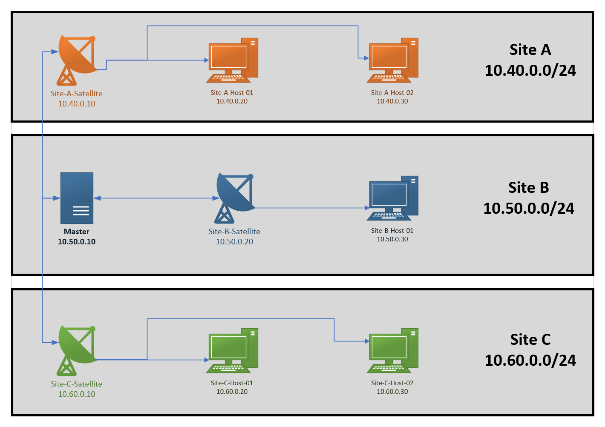
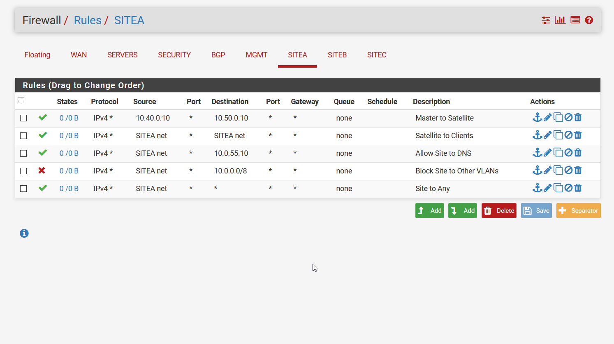
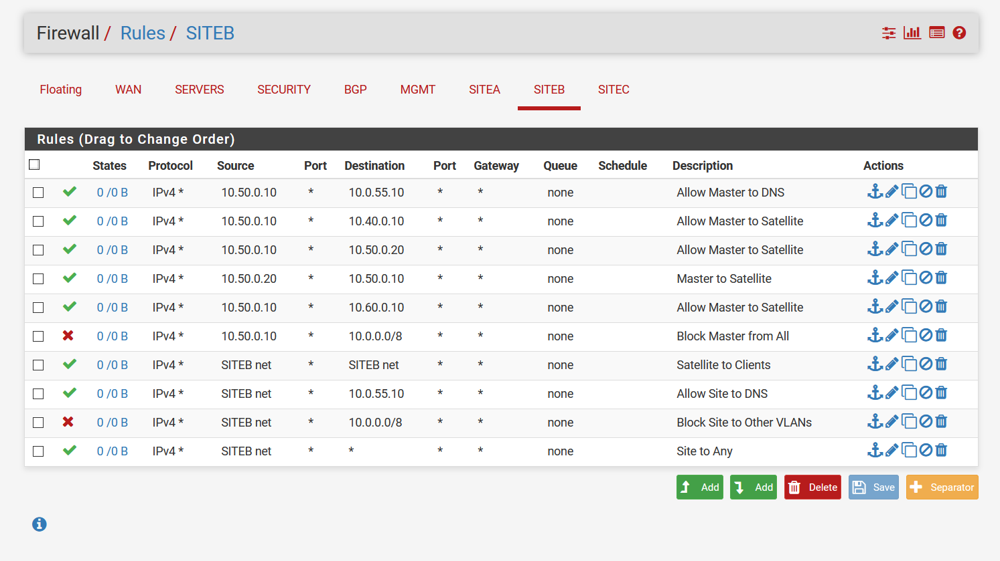
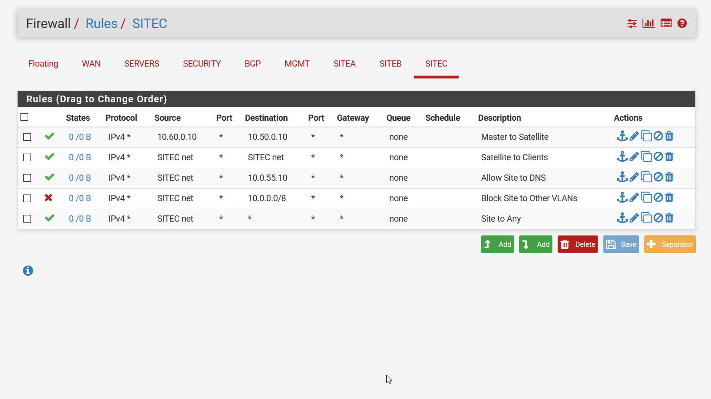

# Part 1 --- Setting up our Icinga Lab

## Summary
I was recently tasked with building out distributed monitoring for our infrastructure that spanned two physical sites and AWS. We decided to go with Icinga2 since that seemed to be the agreed upon best choice. During my time setting this up I found many instances of the documentation missing key steps and or being incorrect. Hopefully this guide will help others like me who are brand new to Icinga2 and need help getting started. In this first part we will setup our simulated multi-site environment. I am doing all of this off of my homelab R720 server. I gave each host, except the master, 50gb of storage, 2gb of RAM, and 2 CPUs. I gave the master 8gb of RAM and 4 CPUs since it has to handle a backend database. We will be placing the master in Site-B to simulate it being in AWS. Since the master server does not do any checks itself, we will also need a satellite in Site-B to monitor our host.

## Terminology
Don't worry if these terms do not make sense right away. I will add context to them as we go through this journey.
* Agent
  * This is a confusing term since it can refer to the Icinga2 service running on an end host or it can refer to the hosts being monitored. For the context of this guide, agent will refer to the Icinga2 service.
* Endpoint
  * This is any server, desktop, device, etc in your infrastructure
* Master
  * The endpoint that has IcingaWeb2 and Director installed on it. Controls and configures the satellites
* Satellite
  * Endpoints that are children of the Master. They are the hosts that do the actual checks on the client endpoints that are in their respective zones. Client endpoints are the devices in your infrastructure that are being monitored by your satellite endpoints and are the children of these satellites.

## Lab Environment
Its important to draw out your environment and plan out how you want to setup your master and satellites. I will be using my homelab to simulate a multi-site setup by using VLANs and firewall rules.
* All VLANs can talk to the internet but they can't talk to each other. The master endpoint is only allowed to talk to the satellite endpoints while the satellite endpoints will only be allowed to talk to the Ubuntu endpoints in their respective VLAN. This will ensure that only the satellites in each zone are doing the monitoring checks.
* VLAN 400
  * Site-A  
  * Satellite
    * Site-A-Satellite
    * 10.40.0.10
    * Ubuntu 18.04 LTS
  * Test hosts
    * Site-A-Host-01
      * 10.40.0.20
      * Ubuntu 18.04 LTS
    * Site-A-Host-02
      * 10.40.0.30
      * Ubuntu 18.04 LTS
* VLAN 500
  * Site-B  
  * Master
    * Master
    * 10.50.0.10
    * Ubuntu 18.04 LTS
    * `iptables -A INPUT -s IP-ADDRESS -j DROP`
      * We will need this since the traffic is inner-vlan and thus will not be impacted by the PFSense firewall rules
  * Satellite
    * Site-B-Satellite
    * 10.50.0.20
    * Ubuntu 18.04 LTS
  * Test hosts
    * Site-B-Host-01
      * 10.50.0.30
      * Ubuntu 18.04 LTS
* VLAN 600
  * Site-C
  * Satellite
    * Site-C-Satellite
    * 10.60.0.10
    * Ubuntu 18.04 LTS
  * Test hosts
    * Site-C-Host-01
      * 10.60.0.20
      * Ubuntu 18.04 LTS
    * Site-C-Host-02
      * 10.60.0.30
      * Ubuntu 18.04 LTS

## Diagram

## Firewall rules
#### Site A

#### Site B

#### Site C

## Resources Used
ESXI 6.7 Hypervisor

## Special Mentions
