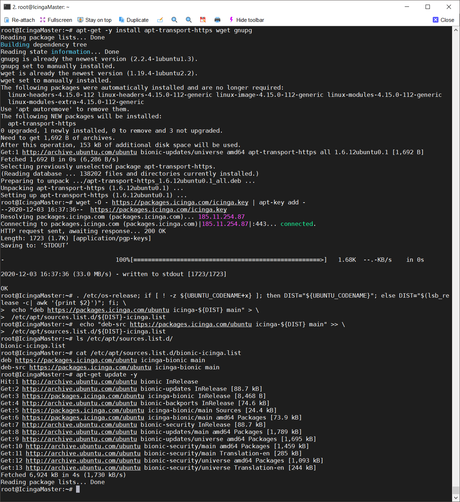
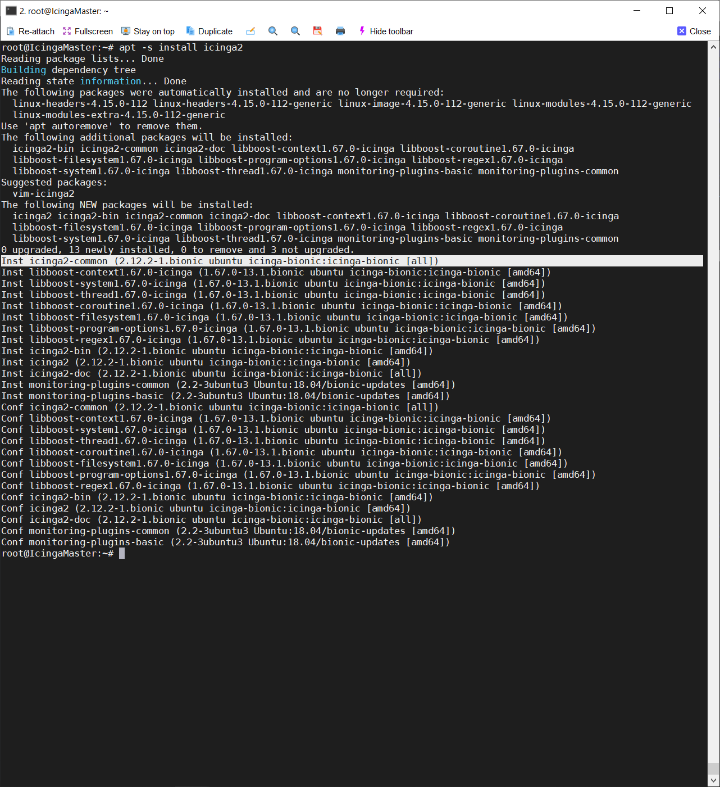
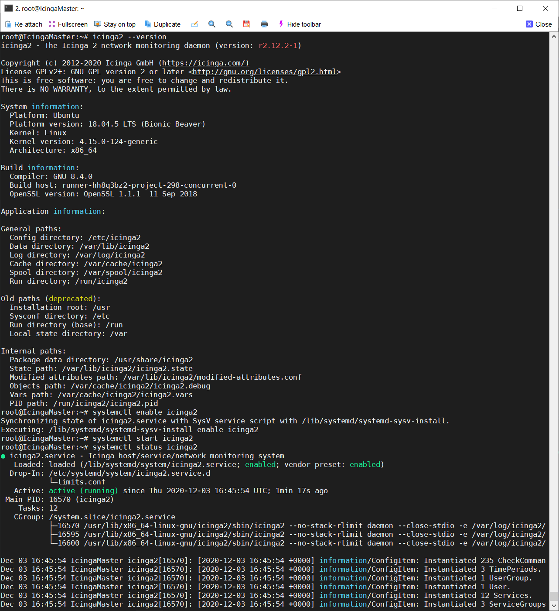

# Installing Icinga2
[Part 1 --- Setting up our Icinga Lab]()

## Summary
In part two of our adventure down the Icinga rabbit hole we will now get our Icinga Endpoints installed. For Master this will mean we need to install Icinga and Icinga Web. For the Satellites we will only be installing Icinga. The client endpoints will not need anything further installed on them yet. Later on in this guide we will spin up Apache and a Windows host to test monitoring HTTP and WinRM services.

**Since this guide will be just as much a journey, I will be showing any mistakes I made and how I troubleshooted them.**

## Installation Process
The first thing that we are going to want to do is to take a snapshot of our VM. In case anything goes wrong we are going to want a fallback. Once we get this first Icinga endpoint installed and documented, the rest will be a lot easier. Let's start on IcingaMaster.

According to the official documentation the following code will install Icinga2 onto our endpoint.

```
apt-get update
apt-get -y install apt-transport-https wget gnupg

wget -O - https://packages.icinga.com/icinga.key | apt-key add -

. /etc/os-release; if [ ! -z ${UBUNTU_CODENAME+x} ]; then DIST="${UBUNTU_CODENAME}"; else DIST="$(lsb_release -c| awk '{print $2}')"; fi; \
 echo "deb https://packages.icinga.com/ubuntu icinga-${DIST} main" > \
 /etc/apt/sources.list.d/${DIST}-icinga.list
 echo "deb-src https://packages.icinga.com/ubuntu icinga-${DIST} main" >> \
 /etc/apt/sources.list.d/${DIST}-icinga.list

apt-get update
```




`apt -s install icinga2` will do a simulation install of icinga. Checking their [releases page on Github](https://github.com/Icinga/icinga2/releases) confirms that v2.12.2 is indeed the most recent version so let's install it with `apt install icinga2 monitoring-plugins -y`.



Looks Good!

To summarize, the complete code to install Icinga is

```
apt-get -y install apt-transport-https wget gnupg

wget -O - https://packages.icinga.com/icinga.key | apt-key add -

. /etc/os-release; if [ ! -z ${UBUNTU_CODENAME+x} ]; then DIST="${UBUNTU_CODENAME}"; else DIST="$(lsb_release -c| awk '{print $2}')"; fi; \
 echo "deb https://packages.icinga.com/ubuntu icinga-${DIST} main" > \
 /etc/apt/sources.list.d/${DIST}-icinga.list
 echo "deb-src https://packages.icinga.com/ubuntu icinga-${DIST} main" >> \
 /etc/apt/sources.list.d/${DIST}-icinga.list

apt-get update
apt install icinga2 monitoring-plugins -y
systemctl enable icinga2
systemctl start icinga2
```

Since I setup my hosts to have my SSH keys, I can use my SSH agent to quickly repeat this task on the satellites.

```
[root@picnicbasket ~]# SCRIPT=$(echo 'apt-get -y install apt-transport-https wget gnupg; wget -O - https://packages.icinga.com/icinga.key | apt-key add -; . /etc/os-release; if [ ! -z ${UBUNTU_CODENAME+x} ]; then DIST="${UBUNTU_CODENAME}"; else DIST="$(lsb_release -c| awk '{print $2}')"; fi; echo "deb https://packages.icinga.com/ubuntu icinga-${DIST} main" > /etc/apt/sources.list.d/${DIST}-icinga.list; echo "deb-src https://packages.icinga.com/ubuntu icinga-${DIST} main" >> /etc/apt/sources.list.d/${DIST}-icinga.list; apt-get update -y; apt install icinga2 monitoring-plugins -y; systemctl enable icinga2; systemctl restart icinga2')
[root@picnicbasket ~]# cat icingahosts | grep Satellite
Site-A-Satellite
Site-B-Satellite
Site-C-Satellite
[root@picnicbasket ~]# for host in $(cat icingahosts | grep Satellite); do ssh root@$host "$SCRIPT"; done
```

Confirmed Working!
```
[root@picnicbasket ~]# for host in $(cat icingahosts | grep -iv host); do ssh root@$host "systemctl status icinga2 | grep Active"; done
   Active: active (running) since Thu 2020-12-03 18:25:23 UTC; 54s ago
   Active: active (running) since Thu 2020-12-03 18:25:26 UTC; 53s ago
   Active: active (running) since Thu 2020-12-03 18:25:28 UTC; 52s ago
   Active: active (running) since Thu 2020-12-03 18:25:31 UTC; 50s ago
```

## Resources Used
https://icinga.com/docs/icinga2/latest/doc/02-installation/
https://computingforgeeks.com/how-to-install-icinga2-monitoring-tool-on-ubuntu-18-04-lts/
https://www.howtoforge.com/how-to-install-icinga-2-monitoring-on-ubuntu-1804/

## Special Mentions
