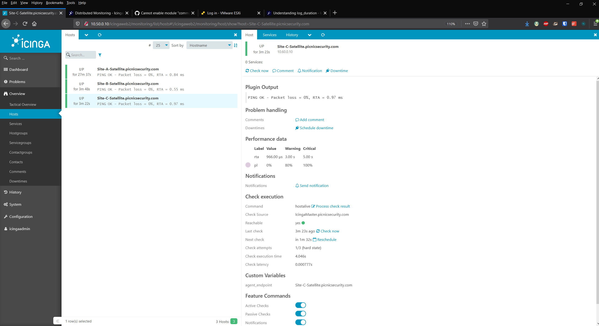

# Establishing the Master Satellite Relationship
[Part 1 --- Setting up our Icinga2 Lab]()

[Part 2 --- Installing Icinga2]()

[Part 3 --- Installing IcingaWeb2]()

## Summary
Up to this point we have not done anything more than get Icinga2 and its web UI installed. In part four of our guide we will begin setting up our Master Satellite relationship. I expect this to be the most tricky part as it is not something can be done with [Icinga Director]() but instead has to be done manually. At the time of writing this, I have not started done this road yet but I am going to operate under the assumption that I should not install Director until after I have established the relationship properly. That way the Kickstarter pulls in the right configuration.

**Since this guide will be just as much a journey, I will be showing any mistakes I made and how I troubleshooted them.**

## Running Icinga2 Node Wizard on Master
As always the first step we are going to take is taking a snapshot of our virtual machines. It is important to note here that if we have to rollback on one server, we might need to rollback on the others. Make sure you are consolidating your disks as well.

The first thing we need to do is run `icinga2 node wizard` on master.
```
root@IcingaMaster:~# icinga2 node wizard
Welcome to the Icinga 2 Setup Wizard!

We will guide you through all required configuration details.

Please specify if this is an agent/satellite setup ('n' installs a master setup) [Y/n]: n

Starting the Master setup routine...

Please specify the common name (CN) [IcingaMaster.picnicsecurity.com]:
Reconfiguring Icinga...
Checking for existing certificates for common name 'IcingaMaster.picnicsecurity.com'...
Certificates not yet generated. Running 'api setup' now.
Generating master configuration for Icinga 2.
Enabling feature api. Make sure to restart Icinga 2 for these changes to take effect.

Master zone name [master]:

Default global zones: global-templates director-global
Do you want to specify additional global zones? [y/N]:
Please specify the API bind host/port (optional):
Bind Host []:
Bind Port []:

Do you want to disable the inclusion of the conf.d directory [Y/n]: Y
Disabling the inclusion of the conf.d directory...
Checking if the api-users.conf file exists...

Done.

Now restart your Icinga 2 daemon to finish the installation!
```

The most important step in this wizard is disabling the inclusion of the conf.d directory. We will see why later on. All the default fields were what I wanted so there was no need for me to fill anything in.

Now we restart the Icinga2 daemon. Afterwards we are going to make sure the command feature is enabled.

```
root@IcingaMaster:~# icinga2 feature list
Disabled features: command compatlog debuglog elasticsearch gelf graphite icingadb influxdb livestatus opentsdb perfdata statusdata syslog
Enabled features: api checker ido-mysql mainlog notification
root@IcingaMaster:~# icinga2 feature enable command
Enabling feature command. Make sure to restart Icinga 2 for these changes to take effect.
root@IcingaMaster:~# systemctl restart icinga2
root@IcingaMaster:~# systemctl status icinga2
● icinga2.service - Icinga host/service/network monitoring system
   Loaded: loaded (/lib/systemd/system/icinga2.service; enabled; vendor preset: enabled)
  Drop-In: /etc/systemd/system/icinga2.service.d
           └─limits.conf
   Active: active (running) since Fri 2020-12-04 18:23:59 UTC; 3s ago
  Process: 10445 ExecStartPre=/usr/lib/icinga2/prepare-dirs /etc/default/icinga2 (code=exited, status=0/SUCCESS)
 Main PID: 10461 (icinga2)
    Tasks: 19
   CGroup: /system.slice/icinga2.service
           ├─10461 /usr/lib/x86_64-linux-gnu/icinga2/sbin/icinga2 --no-stack-rlimit daemon --close-stdio -e /var/log/icinga2/
           ├─10499 /usr/lib/x86_64-linux-gnu/icinga2/sbin/icinga2 --no-stack-rlimit daemon --close-stdio -e /var/log/icinga2/
           └─10504 /usr/lib/x86_64-linux-gnu/icinga2/sbin/icinga2 --no-stack-rlimit daemon --close-stdio -e /var/log/icinga2/

Dec 04 18:23:59 IcingaMaster icinga2[10461]: [2020-12-04 18:23:59 +0000] information/ConfigItem: Instantiated 3 Zones.
Dec 04 18:23:59 IcingaMaster icinga2[10461]: [2020-12-04 18:23:59 +0000] information/ConfigItem: Instantiated 1 Endpoint.
Dec 04 18:23:59 IcingaMaster icinga2[10461]: [2020-12-04 18:23:59 +0000] information/ConfigItem: Instantiated 1 ExternalComma
Dec 04 18:23:59 IcingaMaster icinga2[10461]: [2020-12-04 18:23:59 +0000] information/ConfigItem: Instantiated 1 IdoMysqlConne
Dec 04 18:23:59 IcingaMaster icinga2[10461]: [2020-12-04 18:23:59 +0000] information/ConfigItem: Instantiated 1 ApiUser.
Dec 04 18:23:59 IcingaMaster icinga2[10461]: [2020-12-04 18:23:59 +0000] information/ConfigItem: Instantiated 1 ApiListener.
Dec 04 18:23:59 IcingaMaster icinga2[10461]: [2020-12-04 18:23:59 +0000] information/ConfigItem: Instantiated 235 CheckComman
Dec 04 18:23:59 IcingaMaster icinga2[10461]: [2020-12-04 18:23:59 +0000] information/ScriptGlobal: Dumping variables to file
Dec 04 18:23:59 IcingaMaster icinga2[10461]: [2020-12-04 18:23:59 +0000] information/cli: Closing console log.
Dec 04 18:23:59 IcingaMaster systemd[1]: Started Icinga host/service/network monitoring system.
```

Before moving on to the satellites let's verify that the CA public and private keys are in `/var/lib/icinga2/ca`

```
root@IcingaMaster:~# ls /var/lib/icinga2/ca
ca.crt  ca.key
```

Excellent.

## Running Icinga2 Node Wizard on Satellites

We will be using the same `icinga2 node wizard` command from above just with different selections.

The first thing we will need is for IcingaMaster to generate our Satellite a ticket. We can do this with the following command

```
icinga2 pki ticket --cn Site-B-Satellite.picnicsecurity.com
044bcbf89a25a322f7a41c0eb5a43f1691e7d8d6
```

Now we run the node wizard and fill out the fields accordingly

```
root@Site-A-Satellite:~# icinga2 node wizard
Welcome to the Icinga 2 Setup Wizard!

We will guide you through all required configuration details.

Please specify if this is an agent/satellite setup ('n' installs a master setup) [Y/n]: Y

Starting the Agent/Satellite setup routine...

Please specify the common name (CN) [Site-A-Satellite]: Site-A-Satellite.picnicsecurity.com

Please specify the parent endpoint(s) (master or satellite) where this node should connect to:
Master/Satellite Common Name (CN from your master/satellite node): IcingaMaster.picnicsecurity.com

Do you want to establish a connection to the parent node from this node? [Y/n]: Y
Please specify the master/satellite connection information:
Master/Satellite endpoint host (IP address or FQDN): 10.50.0.10
Master/Satellite endpoint port [5665]: 5665

Add more master/satellite endpoints? [y/N]: N
Parent certificate information:

 Version:             3
 Subject:             CN = IcingaMaster.picnicsecurity.com
 Issuer:              CN = Icinga CA
 Valid From:          Dec  4 18:19:54 2020 GMT
 Valid Until:         Dec  1 18:19:54 2035 GMT
 Serial:              53:f0:24:3b:fd:e1:f4:be:fa:a4:5f:13:e3:31:22:c3:19:13:9e:99

 Signature Algorithm: sha256WithRSAEncryption
 Subject Alt Names:   IcingaMaster.picnicsecurity.com
 Fingerprint:         1B C8 13 00 BE 5F 4C C3 37 8A A5 0D E6 0D B2 BF 70 7B A9 9F D1 5E AE 15 D7 91 C0 B3 F2 29 13 DA

Is this information correct? [y/N]: Y

Please specify the request ticket generated on your Icinga 2 master (optional).
 (Hint: # icinga2 pki ticket --cn 'Site-A-Satellite.picnicsecurity.com'): 044bcbf89a25a322f7a41c0eb5a43f1691e7d8d6
Please specify the API bind host/port (optional):
Bind Host []:
Bind Port []:

Accept config from parent node? [y/N]: Y
Accept commands from parent node? [y/N]: Y

Reconfiguring Icinga...
Disabling feature notification. Make sure to restart Icinga 2 for these changes to take effect.
Enabling feature api. Make sure to restart Icinga 2 for these changes to take effect.

Local zone name [Site-A-Satellite.picnicsecurity.com]: Site-A
Parent zone name [master]: master

Default global zones: global-templates director-global
Do you want to specify additional global zones? [y/N]: N

Do you want to disable the inclusion of the conf.d directory [Y/n]: Y
Disabling the inclusion of the conf.d directory...

Done.

Now restart your Icinga 2 daemon to finish the installation!
```

The important things are accepting configuration and commands from the parent node, and disabling the `conf.d` directory. Since we are doing Top Down Command Endpoint style monitoring, we need this satellite to do whatever it is its parent, IcingaMaster, tells it to do.

Now we can restart the icinga2 daemon with `systemctl restart icinga2`.

Lastly we verify that the certificate files have been stored in the `/var/lib/icinga2/certs` directory

```
root@Site-A-Satellite:~# ls -la /var/lib/icinga2/certs
total 32
drwx------ 2 nagios nagios 4096 Dec  4 18:52 .
drwxr-x--- 4 nagios nagios 4096 Dec  4 18:55 ..
-rw-r--r-- 1 nagios nagios 1720 Dec  4 18:49 ca.crt
-rw-r--r-- 1 nagios nagios 1818 Dec  4 18:49 Site-A-Satellite.picnicsecurity.com.crt
-rw-r--r-- 1 nagios nagios 1854 Dec  4 18:49 Site-A-Satellite.picnicsecurity.com.crt.orig
-rw------- 1 nagios nagios 3243 Dec  4 18:49 Site-A-Satellite.picnicsecurity.com.key
-rw------- 1 nagios nagios 3243 Dec  4 18:49 Site-A-Satellite.picnicsecurity.com.key.orig
-rw------- 1 nagios nagios   40 Dec  4 18:52 ticket
```

Excellent. Now to repeat the above steps on the remaining satellites and thanks to the miracle of time, by the time you start the next sentence I will be done doing so.

## Configuring the Top Down Command Endpoint

This is what everything has lead up to. The reason I will be doing a Top Down Command Endpoint configuration is because I have no plans to install the Icinga2 daemon on any of my client endpoints. All I need is to have the Satellite endpoints do remote checks on my client endpoints (ssh/ping/winrm/http).

The first thing I need to do is include the endpoint and zone configuration on both the Master and the Satellites.
```
root@Site-A-Satellite:/etc/icinga2# ls
conf.d          constants.conf.orig  features-enabled  icinga2.conf.orig  scripts     zones.conf.orig
constants.conf  features-available   icinga2.conf      pki                zones.conf  zones.d
root@Site-A-Satellite:/etc/icinga2# cat zones.conf
/*
 * Generated by Icinga 2 node setup commands
 * on 2020-12-04 18:52:21 +0000
 */

object Endpoint "IcingaMaster.picnicsecurity.com" {
        host = "10.50.0.10"
        port = "5665"
}

object Zone "master" {
        endpoints = [ "IcingaMaster.picnicsecurity.com" ]
}

object Endpoint "Site-A-Satellite.picnicsecurity.com" {
}

object Zone "Site-A" {
        endpoints = [ "Site-A-Satellite.picnicsecurity.com" ]
        parent = "master"
}

object Zone "global-templates" {
        global = true
}

object Zone "director-global" {
        global = true
}


root@Site-A-Satellite:/etc/icinga2# vim zones.conf
root@Site-A-Satellite:/etc/icinga2# cat zones.conf
/*
 * Generated by Icinga 2 node setup commands
 * on 2020-12-04 18:52:21 +0000
 */

object Endpoint "IcingaMaster.picnicsecurity.com" {
        host = "10.50.0.10"
        port = "5665"
}

object Zone "master" {
        endpoints = [ "IcingaMaster.picnicsecurity.com" ]
}

object Endpoint "Site-A-Satellite.picnicsecurity.com" {
        host = "10.40.0.10"
        log_duration = 0
}

object Zone "Site-A" {
        endpoints = [ "Site-A-Satellite.picnicsecurity.com" ]
        parent = "master"
}

object Zone "global-templates" {
        global = true
}

object Zone "director-global" {
        global = true
}
```

In the above snippet you can see that I am checking to make sure that I have an endpoint defined for both the Site-A-Satellite and IcingaMaster. We can also see that we have defined the two zones already

```
object Zone "Site-A" {
        endpoints = [ "Site-A-Satellite.picnicsecurity.com" ]
        parent = "master"
}
```
and
```
object Zone "master" {
        endpoints = [ "IcingaMaster.picnicsecurity.com" ]
}
```

Now we go over to IcingaMaster and make sure it has the same configuration in its `zones.conf` file.

```
root@IcingaMaster:~# cd /etc/icinga2
root@IcingaMaster:/etc/icinga2# ls
conf.d          constants.conf.orig  features-enabled  icinga2.conf.orig  scripts     zones.conf.orig
constants.conf  features-available   icinga2.conf      pki                zones.conf  zones.d
root@IcingaMaster:/etc/icinga2# cat zones.conf
/*
 * Generated by Icinga 2 node setup commands
 * on 2020-12-04 18:20:20 +0000
 */

object Endpoint "IcingaMaster.picnicsecurity.com" {
}

object Zone "master" {
        endpoints = [ "IcingaMaster.picnicsecurity.com" ]
}

object Zone "global-templates" {
        global = true
}

object Zone "director-global" {
        global = true
}


root@IcingaMaster:/etc/icinga2# vim zones.conf
root@IcingaMaster:/etc/icinga2# cat zones.conf
/*
 * Generated by Icinga 2 node setup commands
 * on 2020-12-04 18:20:20 +0000
 */

object Endpoint "IcingaMaster.picnicsecurity.com" {
        host = "10.50.0.10"
        log_duration = 172800
}

object Zone "master" {
        endpoints = [ "IcingaMaster.picnicsecurity.com" ]
}

object Zone "global-templates" {
        global = true
}

object Zone "director-global" {
        global = true
}

object Endpoint "Site-A-Satellite.picnicsecurity.com" {
        host = "10.40.0.10"
}

object Zone "Site-A" {
        endpoints = [ "Site-A-Satellite.picnicsecurity.com" ]
        parent = "master"
}
```

Now we restart Icinga2 on both hosts and see what happens. Fire in the hole.

```
root@IcingaMaster:/etc/icinga2# systemctl restart icinga2 && systemctl status icinga2 | grep Active
   Active: active (running) since Fri 2020-12-04 19:49:24 UTC; 23ms ago
```
```
root@Site-A-Satellite:/etc/icinga2# systemctl restart icinga2 && systemctl status icinga2 | grep Active
   Active: active (running) since Fri 2020-12-04 19:49:31 UTC; 21ms ago
```

Looks like everything came up just fine! Most excellent.

The next step is to define the hosts that will be in each zone. So far we have only worked with the relationship between IcingaMaster and Site-A-Satellite. The `/etc/icinga2/zones.d/` directory is where we will make folders for all of our zones and put the configuration for each zone in its respective folder. Since the Satellites are to be checked by the master itself, their host configuration will go into the master zone. We make the master zone by making a `master` folder in `zones.d`

```
cd /etc/icinga2
mkdir zones.d/master
cd zones.d/master
touch hosts.conf
```

Now we go into our newly made `hosts.conf` file and add a host object for our Site-A-Satellite

```
root@IcingaMaster:/etc/icinga2/zones.d/master# cat hosts.conf
object Host "Site-A-Satellite.picnicsecurity.com" {
        check_command = "hostalive" // check is executed on IcingaMaster
        address = "10.40.0.10"
        vars.agent_endpoint = name // Following the convention that hostname == endpoint name
}
```

We can use `icinga2 daemon -C` to verify our config and then restart our icinga service. Now would be a good time to take a look at our dashboard and see if what we are doing is having the impact we desire.


All lights green! In this screenshot you can see that our Satellite is passing the ping check. `Check Source` is showing `IcingaMaster.picnicsecurity.com` which means that our IcingaMaster is doing the ping check which is what we want. We can also see that our `vars.agent_endpoint` custom variable is set as `Site-A-Satellite.picnicsecurity.com` which is again what we want. We will see the impact of this custom variable down the line.

Before going back to the other satellites and applying the above configuration to them, let's add the remaining satellites to our `hosts.conf` file.

```
// Site-A Satellite
object Host "Site-A-Satellite.picnicsecurity.com" {
        check_command = "hostalive" // check is executed on IcingaMaster
        address = "10.40.0.10"
        vars.agent_endpoint = name // Following the convention that hostname == endpoint name
}
// Site-B Satellite
object Host "Site-B-Satellite.picnicsecurity.com" {
        check_command = "hostalive" // check is executed on IcingaMaster
        address = "10.50.0.20"
        vars.agent_endpoint = name // Following the convention that hostname == endpoint name
}
// Site-C Satellite
object Host "Site-C-Satellite.picnicsecurity.com" {
        check_command = "hostalive" // check is executed on IcingaMaster
        address = "10.60.0.10"
        vars.agent_endpoint = name // Following the convention that hostname == endpoint name
}
```

Adding the other satellites to our `/etc/icinga2/zones.conf` file

```
/*
 * Generated by Icinga 2 node setup commands
 * on 2020-12-04 18:20:20 +0000
 */

object Endpoint "IcingaMaster.picnicsecurity.com" {
        host = "10.50.0.10"
        log_duration = 172800
}

object Zone "master" {
        endpoints = [ "IcingaMaster.picnicsecurity.com" ]
}

object Zone "global-templates" {
        global = true
}

object Zone "director-global" {
        global = true
}

object Endpoint "Site-A-Satellite.picnicsecurity.com" {
        host = "10.40.0.10"
}

object Zone "Site-A" {
        endpoints = [ "Site-A-Satellite.picnicsecurity.com" ]
        parent = "master"
}

object Endpoint "Site-B-Satellite.picnicsecurity.com" {
        host = "10.50.0.20"
}

object Zone "Site-B" {
        endpoints = [ "Site-B-Satellite.picnicsecurity.com" ]
        parent = "master"
}

object Endpoint "Site-C-Satellite.picnicsecurity.com" {
        host = "10.60.0.10"
}

object Zone "Site-C" {
        endpoints = [ "Site-C-Satellite.picnicsecurity.com" ]
        parent = "master"
}
```

We also will make a folder in `zones.d` for each of our `Site-X` zones.

```
root@IcingaMaster:/etc/icinga2# cd zones.d
root@IcingaMaster:/etc/icinga2/zones.d# mkdir Site-A
root@IcingaMaster:/etc/icinga2/zones.d# mkdir Site-B
root@IcingaMaster:/etc/icinga2/zones.d# mkdir Site-C
root@IcingaMaster:/etc/icinga2/zones.d# ls
master  README  Site-A  Site-B  Site-C
```

Check our configuration and then restart the Icinga service

```
root@IcingaMaster:/etc/icinga2/zones.d# icinga2 daemon -C
[2020-12-04 20:32:00 +0000] information/cli: Icinga application loader (version: r2.12.2-1)
[2020-12-04 20:32:00 +0000] information/cli: Loading configuration file(s).
[2020-12-04 20:32:00 +0000] information/ConfigItem: Committing config item(s).
[2020-12-04 20:32:00 +0000] information/ApiListener: My API identity: IcingaMaster.picnicsecurity.com
[2020-12-04 20:32:00 +0000] information/ConfigItem: Instantiated 1 NotificationComponent.
[2020-12-04 20:32:00 +0000] information/ConfigItem: Instantiated 3 Hosts.
[2020-12-04 20:32:00 +0000] information/ConfigItem: Instantiated 1 FileLogger.
[2020-12-04 20:32:00 +0000] information/ConfigItem: Instantiated 1 IcingaApplication.
[2020-12-04 20:32:00 +0000] information/ConfigItem: Instantiated 1 CheckerComponent.
[2020-12-04 20:32:00 +0000] information/ConfigItem: Instantiated 6 Zones.
[2020-12-04 20:32:00 +0000] information/ConfigItem: Instantiated 4 Endpoints.
[2020-12-04 20:32:00 +0000] information/ConfigItem: Instantiated 1 ExternalCommandListener.
[2020-12-04 20:32:00 +0000] information/ConfigItem: Instantiated 1 IdoMysqlConnection.
[2020-12-04 20:32:00 +0000] information/ConfigItem: Instantiated 1 ApiUser.
[2020-12-04 20:32:00 +0000] information/ConfigItem: Instantiated 1 ApiListener.
[2020-12-04 20:32:00 +0000] information/ConfigItem: Instantiated 235 CheckCommands.
[2020-12-04 20:32:00 +0000] information/ScriptGlobal: Dumping variables to file '/var/cache/icinga2/icinga2.vars'
[2020-12-04 20:32:00 +0000] information/cli: Finished validating the configuration file(s).
root@IcingaMaster:/etc/icinga2/zones.d# systemctl restart icinga 2'
>
root@IcingaMaster:/etc/icinga2/zones.d# systemctl restart icinga 2
Failed to restart icinga.service: Unit icinga.service not found.
Failed to restart 2.service: Unit 2.service not found.
root@IcingaMaster:/etc/icinga2/zones.d# systemctl restart icinga2
root@IcingaMaster:/etc/icinga2/zones.d# systemctl status icinga2
● icinga2.service - Icinga host/service/network monitoring system
   Loaded: loaded (/lib/systemd/system/icinga2.service; enabled; vendor preset: enabled)
  Drop-In: /etc/systemd/system/icinga2.service.d
           └─limits.conf
   Active: active (running) since Fri 2020-12-04 20:32:10 UTC; 5s ago
  Process: 11806 ExecStartPre=/usr/lib/icinga2/prepare-dirs /etc/default/icinga2 (code=exited, status=0/SUCCESS)
 Main PID: 11820 (icinga2)
    Tasks: 20
   CGroup: /system.slice/icinga2.service
           ├─11820 /usr/lib/x86_64-linux-gnu/icinga2/sbin/icinga2 --no-stack-rlimit daemon --close-stdio -e /var/log/icinga2/
           ├─11848 /usr/lib/x86_64-linux-gnu/icinga2/sbin/icinga2 --no-stack-rlimit daemon --close-stdio -e /var/log/icinga2/
           └─11853 /usr/lib/x86_64-linux-gnu/icinga2/sbin/icinga2 --no-stack-rlimit daemon --close-stdio -e /var/log/icinga2/

Dec 04 20:32:10 IcingaMaster icinga2[11820]: [2020-12-04 20:32:10 +0000] information/ConfigItem: Instantiated 6 Zones.
Dec 04 20:32:10 IcingaMaster icinga2[11820]: [2020-12-04 20:32:10 +0000] information/ConfigItem: Instantiated 4 Endpoints.
Dec 04 20:32:10 IcingaMaster icinga2[11820]: [2020-12-04 20:32:10 +0000] information/ConfigItem: Instantiated 1 ExternalComma
Dec 04 20:32:10 IcingaMaster icinga2[11820]: [2020-12-04 20:32:10 +0000] information/ConfigItem: Instantiated 1 IdoMysqlConne
Dec 04 20:32:10 IcingaMaster icinga2[11820]: [2020-12-04 20:32:10 +0000] information/ConfigItem: Instantiated 1 ApiUser.
Dec 04 20:32:10 IcingaMaster icinga2[11820]: [2020-12-04 20:32:10 +0000] information/ConfigItem: Instantiated 1 ApiListener.
Dec 04 20:32:10 IcingaMaster icinga2[11820]: [2020-12-04 20:32:10 +0000] information/ConfigItem: Instantiated 235 CheckComman
Dec 04 20:32:10 IcingaMaster icinga2[11820]: [2020-12-04 20:32:10 +0000] information/ScriptGlobal: Dumping variables to file
Dec 04 20:32:10 IcingaMaster icinga2[11820]: [2020-12-04 20:32:10 +0000] information/cli: Closing console log.
Dec 04 20:32:10 IcingaMaster systemd[1]: Started Icinga host/service/network monitoring system.
```

And on our Web UI we can see



Most Excellent!!


## Resources Used
https://icinga.com/docs/icinga-2/latest/doc/06-distributed-monitoring/#master-setup
https://icinga.com/docs/icinga-2/latest/doc/06-distributed-monitoring/#agentsatellite-setup
https://icinga.com/docs/icinga-2/latest/doc/06-distributed-monitoring/#top-down
https://community.icinga.com/t/understanding-log-duration/1679

## Special Mentions
