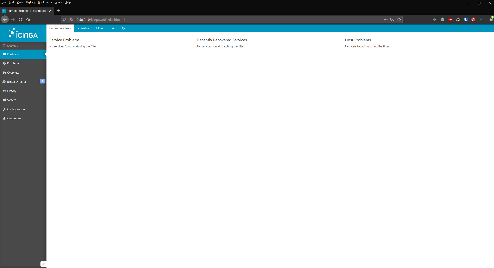

# Installing Icinga Director
[Part 1 --- Setting up our Icinga2 Lab]()

[Part 2 --- Installing Icinga2]()

[Part 3 --- Installing IcingaWeb2]()

[Part 4 --- Establishing the Master Satellite Relationship]()

[Part 5 --- Addressing Design Flaws]()

## Introduction
[Icinga Director](https://icinga.com/docs/icinga-director/latest/) is a tool that will make adding hosts to be monitored a breeze. We can create pre-defined templates for each type of host that we have in our network and then add hosts with that template. If you have a bunch of Linux servers that all need to have SSH and Ping checked then you could make a template that imports the SSH and Ping checks and then apply that template to those Linux servers. It helps keep us in the GUI rather than the CLI. However, as with a majority of tools that bring the CLI to a GUI, Director has limitations. All the manual setup and configuration we have done up to this point is because Director couldn't do it. Director will import our existing configuration using the Kickstart process. We also use this process to investigate how we would import an Satellite. This will ensure our distributed monitoring solution is scalable. See part four, [Addressing Design Flaws](), for more details on that.

First things first. We need to take a snapshot of our Master and Satellites and then consolidate their disks. I have not deleted any snapshots up until now and I do not plan on deleting these snapshots until this is fully complete. Afterwards we can start the installation process.

**Since this guide will be just as much a journey, I will be showing any mistakes I made and how I troubleshooted them.**

## Installing Director
The first thing we need to do is setup the Director database in MySQL. The password we used to access MySQL was `MySQLRoot123!`. We set this password back in [part three]().

```
root@IcingaMaster:~# mysql -u root -p
Enter password:
Welcome to the MySQL monitor.  Commands end with ; or \g.
Your MySQL connection id is 9
Server version: 5.7.32-0ubuntu0.18.04.1 (Ubuntu)

Copyright (c) 2000, 2020, Oracle and/or its affiliates. All rights reserved.

Oracle is a registered trademark of Oracle Corporation and/or its
affiliates. Other names may be trademarks of their respective
owners.

Type 'help;' or '\h' for help. Type '\c' to clear the current input statement.

mysql> CREATE DATABASE director CHARACTER SET 'utf8';
Query OK, 0 rows affected (0.00 sec)

mysql> CREATE USER director@localhost IDENTIFIED BY 'DirectorDBPass!';
ERROR 1819 (HY000): Your password does not satisfy the current policy requirements
mysql> CREATE USER director@localhost IDENTIFIED BY 'DirectorDBPass123!';
Query OK, 0 rows affected (0.00 sec)

mysql> GRANT ALL ON director.* TO director@localhost;
Query OK, 0 rows affected (0.00 sec)

mysql> flush privileges;
Query OK, 0 rows affected (0.00 sec)

mysql> exit
Bye
```

Make note of the password you use for the director user as we will need it later. In my case this is `DirectorDBPass123!`. Next we will need to login to the Web UI with the `icingaadmin`/`IcingaAdminPassword123!` credentials.


We are going to create a new database resource and have it point to the Director database that we just configured. First we go to `Configuration -> Application -> Resources` and click on `Create a New Resource`.


Now we fill out the fields using the same information we provided to MySQL above.


After validating the configuration hit save changes.


Next we will grab the latest tarball release of Director and put it into our modules directory. Their documentation on their Github page provides a useful series of commands for us to run. We are going to modify these commands so that anyone coming after us will always get the latest version. We can achieve this with some bashfoo.

```
root@IcingaMaster:~# curl https://github.com/Icinga/icingaweb2-module-director/releases/latest
<html><body>You are being <a href="https://github.com/Icinga/icingaweb2-module-director/releases/tag/v1.7.2">redirected</a>  .</body></html>root@IcingaMaster:~# curl https://github.com/Icinga/icingaweb2-module-director/releases/latest | cut -d"=" -  f 1 | cut -d">" -f 0
> ^C
root@IcingaMaster:~# curl https://github.com/Icinga/icingaweb2-module-director/releases/latest | cut -d"=" -f 1 | cut -d"="   -f 1 | cut -d">" -f 0
cut: fields are numbered from 1
Try 'cut --help' for more information.
  % Total    % Received % Xferd  Average Speed   Time    Time     Time  Current
                                 Dload  Upload   Total   Spent    Left  Speed
100   138  100   138    0     0   1301      0 --:--:-- --:--:-- --:--:--  1301
root@IcingaMaster:~# curl https://github.com/Icinga/icingaweb2-module-director/releases/latest | cut -d"=" -f 1 | cut -d"=" -
  % Total    % Received % Xferd  Average Speed   Time    Time     Time  Current
                                 Dload  Upload   Total   Spent    Left  Speed
100   138  100   138    0     0   1864      0 --:--:-- --:--:-- --:--:--  1864
<html
root@IcingaMaster:~# curl https://github.com/Icinga/icingaweb2-module-director/releases/latest #| cut -d"=" -f 1 | cut -d"="
<html><body>You are being <a href="https://github.com/Icinga/icingaweb2-module-director/releases/tag/v1.7.2">redirected</a>.<  % Total    % Received % Xferd  Average Speed   Time    Time     Time  Current
                                 Dload  Upload   Total   Spent    Left  Speed
100   138  100   138    0     0   3066      0 --:--:-- --:--:-- --:--:--  3066
<html><body>You are being <a href
root@IcingaMaster:~# curl https://github.com/Icinga/icingaweb2-module-director/releases/latest | cut -d"=" -f 2 | cut -d">" -
  % Total    % Received % Xferd  Average Speed   Time    Time     Time  Current
                                 Dload  Upload   Total   Spent    Left  Speed
100   138  100   138    0     0   1682      0 --:--:-- --:--:-- --:--:--  1682
"https://github.com/Icinga/icingaweb2-module-director/releases/tag/v1.7.2"
root@IcingaMaster:~# curl https://github.com/Icinga/icingaweb2-module-director/releases/latest --quiet | cut -d"=" -f 2 | cut
curl: option --quiet: is unknown
curl: try 'curl --help' or 'curl --manual' for more information
root@IcingaMaster:~# curl https://github.com/Icinga/icingaweb2-module-director/releases/latest --silent | cut -d"=" -f 2 | cu
"https://github.com/Icinga/icingaweb2-module-director/releases/tag/v1.7.2"
root@IcingaMaster:~# curl https://github.com/Icinga/icingaweb2-module-director/releases/latest --silent | cut -d"=" -f 2 | cut -d">" -f 1 | rev | cut -d"/" -f 1
"2.7.1v
root@IcingaMaster:~# curl https://github.com/Icinga/icingaweb2-module-director/releases/latest --silent | cut -d"=" -f 2 | cut -d">" -f 1 | cut -d'"' -f 2 | rev | cut -d"/" -f 1
2.7.1v
root@IcingaMaster:~# curl https://github.com/Icinga/icingaweb2-module-director/releases/latest --silent | cut -d"=" -f 2 | cut -d">" -f 1 | cut -d'"' -f 2 | rev | cut -d"/" -f 1 | rev
v1.7.2
root@IcingaMaster:~# MODULE_VERSION=$(curl https://github.com/Icinga/icingaweb2-module-director/releases/latest --silent | cut -d"=" -f 2 | cut -d">" -f 1 | cut -d'"' -f 2 | rev | cut -d"/" -f 1 | rev)
root@IcingaMaster:~# echo $MODULE_VERSION
v1.7.2
```

Now that we have a way to always get the latest version number, our series of commands looks like this.

```
ICINGAWEB_MODULEPATH="/usr/share/icingaweb2/modules"
REPO_URL="https://github.com/icinga/icingaweb2-module-director"
TARGET_DIR="${ICINGAWEB_MODULEPATH}/director"
# Modified Command
MODULE_VERSION=$(curl https://github.com/Icinga/icingaweb2-module-director/releases/latest --silent | cut -d"=" -f 2 | cut -d">" -f 1 | cut -d'"' -f 2 | rev | cut -d"/" -f 1 | rev)
# Also modified since the above command will also give us the 'v'
URL="${REPO_URL}/archive/${MODULE_VERSION}.tar.gz"
install -d -m 0755 "${TARGET_DIR}"
wget -q -O - "$URL" | tar xfz - -C "${TARGET_DIR}" --strip-components 1
```

```
root@IcingaMaster:~# ICINGAWEB_MODULEPATH="/usr/share/icingaweb2/modules"
root@IcingaMaster:~# REPO_URL="https://github.com/icinga/icingaweb2-module-director"
root@IcingaMaster:~# TARGET_DIR="${ICINGAWEB_MODULEPATH}/director"
root@IcingaMaster:~# # Modified Command
root@IcingaMaster:~# MODULE_VERSION=$(curl https://github.com/Icinga/icingaweb2-module-director/releases/latest --silent | cut -d"=" -f 2 | cut -d">" -f 1 | cut -d'"' -f 2 | rev | cut -d"/" -f 1 | rev)
root@IcingaMaster:~# # Also modified since the above command will also give us the 'v'
root@IcingaMaster:~# URL="${REPO_URL}/archive/${MODULE_VERSION}.tar.gz"
root@IcingaMaster:~# install -d -m 0755 "${TARGET_DIR}"
root@IcingaMaster:~# wget -q -O - "$URL" | tar xfz - -C "${TARGET_DIR}" --strip-components 1
root@IcingaMaster:~# cd /usr/share/icingaweb2/modules
root@IcingaMaster:/usr/share/icingaweb2/modules# ls
director  doc  migrate  monitoring  setup  test  translation
root@IcingaMaster:/usr/share/icingaweb2/modules# ls director
application        contrib  library  module.info  phpunit.xml  README.md           run-missingdeps.php  run-php5.3.php  test
configuration.php  doc      LICENSE  phpcs.xml    public       register-hooks.php  run.php              schema
```

Looks like everything worked out. Excellent. Now we can proceed to enabling the module. Enabling can be done with a single `icingacli` command

```
root@IcingaMaster:/usr/share/icingaweb2/modules# icingacli module enable director
Launching the run script /etc/icingaweb2/enabledModules/director/run.php for module director failed with the following exception: Missing dependencies, please check
```

Looks like we forgot to install some dependencies. I seem to have missed this part of the documentation.

```
The following Icinga modules must be installed and enabled:
ipl (>=0.3.0)
incubator (>=0.5.0)
reactbundle (>=0.7.0)
```

`reactbundle`
```
MODULE_NAME=reactbundle
MODULE_VERSION=v0.8.0
MODULES_PATH="/usr/share/icingaweb2/modules"
MODULE_PATH="${MODULES_PATH}/${MODULE_NAME}"
RELEASES="https://github.com/Icinga/icingaweb2-module-${MODULE_NAME}/archive"
mkdir "$MODULE_PATH" \
&& wget -q $RELEASES/${MODULE_VERSION}.tar.gz -O - \
   | tar xfz - -C "$MODULE_PATH" --strip-components 1
icingacli module enable "${MODULE_NAME}"
```

`ipl`
```
MODULE_NAME=ipl
MODULE_VERSION=v0.5.0
MODULES_PATH="/usr/share/icingaweb2/modules"
MODULE_PATH="${MODULES_PATH}/${MODULE_NAME}"
RELEASES="https://github.com/Icinga/icingaweb2-module-${MODULE_NAME}/archive"
mkdir "$MODULE_PATH" \
&& wget -q $RELEASES/${MODULE_VERSION}.tar.gz -O - \
   | tar xfz - -C "$MODULE_PATH" --strip-components 1
icingacli module enable "${MODULE_NAME}"
```

`Incubator`
```
MODULE_NAME=incubator
MODULE_VERSION=v0.6.0
MODULES_PATH="/usr/share/icingaweb2/modules"
MODULE_PATH="${MODULES_PATH}/${MODULE_NAME}"
RELEASES="https://github.com/Icinga/icingaweb2-module-${MODULE_NAME}/archive"
mkdir "$MODULE_PATH" \
&& wget -q $RELEASES/${MODULE_VERSION}.tar.gz -O - \
   | tar xfz - -C "$MODULE_PATH" --strip-components 1
icingacli module enable "${MODULE_NAME}"
```

However this also gives me the same dependency error.
```
root@IcingaMaster:/usr/share/icingaweb2/modules# icingacli module enable "${MODULE_NAME}"
Launching the run script /usr/share/icingaweb2/modules/director/run.php for module director failed with the following exception: Missing dependencies, please check
```

I thought I had all the PHP modules installed but given that is the only other requirement it is worth double checking.

```
root@IcingaMaster:/usr/share/icingaweb2/modules# php --version
PHP 7.2.24-0ubuntu0.18.04.7 (cli) (built: Oct  7 2020 15:24:25) ( NTS )
Copyright (c) 1997-2018 The PHP Group
Zend Engine v3.2.0, Copyright (c) 1998-2018 Zend Technologies
    with Zend OPcache v7.2.24-0ubuntu0.18.04.7, Copyright (c) 1999-2018, by Zend Technologies
root@IcingaMaster:/usr/share/icingaweb2/modules# php --modules | grep "mysql\|curl\|iconv\|pcntl\|posix\|sockets\|mbstring\|json"
curl
iconv
json
mysqli
mysqlnd
pcntl
pdo_mysql
posix
sockets
```

Looks like I am missing `mbstring` which is weird given that the documentation has it listed as being required by IcingaWeb2. Regardless, I will go ahead and get that installed with `apt-get install php7.2-mbstring`. Now we check our modules again.

```
root@IcingaMaster:/usr/share/icingaweb2/modules# php --modules | grep "mysql\|curl\|iconv\|pcntl\|posix\|sockets\|mbstring\|json"
curl
iconv
json
mbstring
mysqli
mysqlnd
pcntl
pdo_mysql
posix
sockets
```

Alright now let's try to install the other dependencies now.

```
root@IcingaMaster:/usr/share/icingaweb2/modules# MODULE_NAME=reactbundle
root@IcingaMaster:/usr/share/icingaweb2/modules# icingacli module enable "${MODULE_NAME}"
root@IcingaMaster:/usr/share/icingaweb2/modules# MODULE_NAME=ipl
root@IcingaMaster:/usr/share/icingaweb2/modules# icingacli module enable "${MODULE_NAME}"
root@IcingaMaster:/usr/share/icingaweb2/modules# MODULE_NAME=Incubator
root@IcingaMaster:/usr/share/icingaweb2/modules# icingacli module enable "${MODULE_NAME}"
root@IcingaMaster:/usr/share/icingaweb2/modules# MODULE_NAME=director
root@IcingaMaster:/usr/share/icingaweb2/modules# icingacli module enable "${MODULE_NAME}"
root@IcingaMaster:/usr/share/icingaweb2/modules# systemctl restart icinga2
```

## Running the Kickstart Wizard

Now that we have Director installed, our next step is to run the kickstart wizard. The hope here is that it will retain our [Top Down Command Endpoint]() configuration. Let's log back into our Web UI and see what we have.

   


Before we can do the kickstart wizard we need to select our `director_db` resource that we made earlier as our database.

**Before we continue I am going to create another snapshot of our Master and Satellites just to be safe**

Next we will create the schema


It looks like we need to get the API user setup. To do this we visit IcingaMaster and see where `api-users.conf` is located at.

```
root@IcingaMaster:/etc/icinga2# ls conf.d
api-users.conf  apt.conf       downtimes.conf  hosts.conf          services.conf   timeperiods.conf
app.conf        commands.conf  groups.conf     notifications.conf  templates.conf  users.conf
root@IcingaMaster:/etc/icinga2# ls zones.d
master  README  Site-A  Site-B  Site-C
root@IcingaMaster:/etc/icinga2# ls
conf.d          constants.conf.orig  features-enabled  icinga2.conf.orig  scripts     zones.conf.orig
constants.conf  features-available   icinga2.conf      pki                zones.conf  zones.d
root@IcingaMaster:/etc/icinga2# tail icinga2.conf

/**
 * Although in theory you could define all your objects in this file
 * the preferred way is to create separate directories and files in the conf.d
 * directory. Each of these files must have the file extension ".conf".
 */
// Disabled by the node setup CLI command on 2020-12-04 18:20:46 +0000
// include_recursive "conf.d"
// Added by the node setup CLI command on 2020-12-04 18:20:46 +0000
include "conf.d/api-users.conf"
```

Since we are not using `conf.d` for anything else, I am going to want to move this out of that directory and into the `zones.d` directory.

```
root@IcingaMaster:/etc/icinga2/conf.d# cat api-users.conf
/**
 * The ApiUser objects are used for authentication against the API.
 */
object ApiUser "root" {
  password = "7c7118f85a90200b"
  // client_cn = ""

  permissions = [ "*" ]
}
root@IcingaMaster:/etc/icinga2/conf.d# vim api-users.conf
root@IcingaMaster:/etc/icinga2/conf.d# cat api-users.conf
/**
 * The ApiUser objects are used for authentication against the API.
 */
object ApiUser "root" {
  password = "7c7118f85a90200b"
  // client_cn = ""

  permissions = [ "*" ]
}

object ApiUser "director" {
  password = "DirectorAPIPassword123!"
  // client_cn = ""
  permissions = [ "*" ]
}
root@IcingaMaster:/etc/icinga2# vim icinga2.conf
root@IcingaMaster:/etc/icinga2# tail -n 8 icinga2.conf
 */
// Disabled by the node setup CLI command on 2020-12-04 18:20:46 +0000
// include_recursive "conf.d"
// Added by the node setup CLI command on 2020-12-04 18:20:46 +0000
// Disabled by adam on 2020-12-07 11:07:00 +0000
// include "conf.d/api-users.conf"
// Added by adam on 2020-12-07 11:07:00 +0000
include "zones.d/api-users.conf"
root@IcingaMaster:/etc/icinga2# mv conf.d/api-users.conf zones.d/api-users.conf
root@IcingaMaster:/etc/icinga2# systemctl restart icinga2
```

We have now configured Icinga to have an API user called `director` that has the password `DirectorAPIPassword123!` and all the permissions. We can now add this information to the kickstart wizard.


Once it finishes with its import, we see the following.


Looks like we have a whole bunch of yellow which is better than red but worse than green. Checking in on the health tab we see the following.


It would appear that it is unhappy about the 247 changes that the kickstart wizard made but did not deploy. Before we deploy those changes let us also check the Daemon tab.


It would seem that we need to get the Director background daemon running. In order to do this we are fire going to need to make a user for it.

```
useradd -r -g icingaweb2 -d /var/lib/icingadirector -s /bin/false icingadirector
install -d -o icingadirector -g icingaweb2 -m 0750 /var/lib/icingadirector
```

Then we copy the unit-file into systemd, reload systemd, enable the service, and the run it.

```
MODULE_PATH=/usr/share/icingaweb2/modules/director
cp "${MODULE_PATH}/contrib/systemd/icinga-director.service" /etc/systemd/system/
systemctl daemon-reload
systemctl enable icinga-director.service
systemctl start icinga-director.service
```


Now we will go into the `Activity Log` and deploy all of our changes.


Excellent.

## Verifying our Top Down Command Endpoint Configuration

We need to verify that our Top Down Command Endpoint Configuration from part four is still in place and that it got imported by the kickstart wizard correctly. If we go into `Icinga Director -> Icinga Infrastructure` we should see that we already have zones and endpoints configured.


Next if we click on one of our satellites we will see that it does not have an API user defined. Let's add that in now.

```
root@Site-A-Satellite:~# updatedb
root@Site-A-Satellite:~# locate api-users.conf
root@Site-A-Satellite:~# icinga2 api setup
information/cli: Generating new CA.
information/base: Writing private key to '/var/lib/icinga2/ca//ca.key'.
information/base: Writing X509 certificate to '/var/lib/icinga2/ca//ca.crt'.
information/cli: Private key file '/var/lib/icinga2/certs//Site-A-Satellite.picnicsecurity.com.key' already exists, not generating new certificate.
information/cli: Adding new ApiUser 'root' in '/etc/icinga2/conf.d/api-users.conf'.
information/cli: Reading '/etc/icinga2/icinga2.conf'.
information/cli: Updating '"conf.d/api-users.conf"' include in '/etc/icinga2/icinga2.conf'.
information/cli: Backup file '/etc/icinga2/icinga2.conf.orig' already exists. Skipping backup.
information/cli: Enabling the 'api' feature.
warning/cli: Feature 'api' already enabled.
information/cli: Updating 'NodeName' constant in '/etc/icinga2/constants.conf'.
information/cli: Backup file '/etc/icinga2/constants.conf.orig' already exists. Skipping backup.
information/cli: Updating 'ZoneName' constant in '/etc/icinga2/constants.conf'.
information/cli: Backup file '/etc/icinga2/constants.conf.orig' already exists. Skipping backup.
Done.

Now restart your Icinga 2 daemon to finish the installation!
```

This does not appear to be what I wanted. I do not know why it would be generating a new CA. As far as I am aware IcingaMaster should be the CA. I think I should have just made an `api-users.conf` file in the `zones.d` directory and then adding an include statement in `icinga2.conf`.  **I am going to roll back this change by reverting to my previous snapshot and do that instead**.

```
root@Site-A-Satellite:/etc/icinga2# cd zones.d/
root@Site-A-Satellite:/etc/icinga2/zones.d# ls -la
total 12
drwxr-x--- 2 nagios nagios 4096 Dec  3 17:11 .
drwxr-x--- 8 nagios nagios 4096 Dec  4 19:40 ..
-rw-r--r-- 1 root   root    119 Nov 30 15:38 README
root@Site-A-Satellite:/etc/icinga2/zones.d# ls -la ../conf.d/services.conf
-rw-r--r-- 1 nagios nagios 2131 Nov 30 15:38 ../conf.d/services.conf
root@Site-A-Satellite:/etc/icinga2/zones.d# cp ../conf.d/services.conf api-users.conf
root@Site-A-Satellite:/etc/icinga2/zones.d# chown nagios:nagios api-users.conf # Maintaining permissions
root@Site-A-Satellite:/etc/icinga2/zones.d# ls -la
total 16
drwxr-x--- 2 nagios nagios 4096 Dec  7 17:00 .
drwxr-x--- 8 nagios nagios 4096 Dec  4 19:40 ..
-rw-r--r-- 1 nagios nagios 2131 Dec  7 17:00 api-users.conf
-rw-r--r-- 1 root   root    119 Nov 30 15:38 README
root@Site-A-Satellite:/etc/icinga2/zones.d# vim api-users.conf
root@Site-A-Satellite:/etc/icinga2/zones.d# cat api-users.conf
object ApiUser "director" {
  password = "DirectorAPIPassword123!"
  // client_cn = ""
  permissions = [ "*" ]
}
root@Site-A-Satellite:/etc/icinga2/zones.d# cd ..
root@Site-A-Satellite:/etc/icinga2# vim icinga2.conf
root@Site-A-Satellite:/etc/icinga2# tail -n 5 icinga2.conf
 */
// Disabled by the node setup CLI command on 2020-12-04 18:52:23 +0000
// include_recursive "conf.d"
// Added by adam on 2020-12-07 11:07:00 +0000
include "zones.d/api-users.conf"
root@Site-A-Satellite:/etc/icinga2# systemctl restart icinga2
```

Now we can go back into the Web UI to test our changes.


To confirm that the API connection is established we can click on the `Inspect` tab


Let's repeat these steps for our remaining Satellites.

```
vim /etc/icinga2/zones.d/api-users.conf
object ApiUser "director" {
  password = "DirectorAPIPassword123!"
  // client_cn = ""
  permissions = [ "*" ]
}
chown nagios:nagios /etc/icinga2/zones.d/api-users.conf
echo '// Added by adam on 2020-12-07 11:07:00 +0000' >> /etc/icinga2/icinga2.conf
echo 'include "zones.d/api-users.conf"' >> /etc/icinga2/icinga2.conf
systemctl restart icinga2
```


Everything appears to be in order. Excellent!


## Summary
Since this part required some troubleshooting, I am going to give the final code here. That way the correct code does not get lost.

```
mysql -u root -p
mysql> CREATE DATABASE director CHARACTER SET 'utf8';
mysql> CREATE USER director@localhost IDENTIFIED BY 'DirectorDBPass123!';
mysql> GRANT ALL ON director.* TO director@localhost;
mysql> flush privileges;
mysql> exit

# Create new database resource

apt-get install php7.2-mbstring

MODULE_NAME=reactbundle
MODULE_VERSION=v0.8.0
MODULES_PATH="/usr/share/icingaweb2/modules"
MODULE_PATH="${MODULES_PATH}/${MODULE_NAME}"
RELEASES="https://github.com/Icinga/icingaweb2-module-${MODULE_NAME}/archive"
mkdir "$MODULE_PATH" \
&& wget -q $RELEASES/${MODULE_VERSION}.tar.gz -O - \
   | tar xfz - -C "$MODULE_PATH" --strip-components 1
icingacli module enable "${MODULE_NAME}"

MODULE_NAME=ipl
MODULE_VERSION=v0.5.0
MODULES_PATH="/usr/share/icingaweb2/modules"
MODULE_PATH="${MODULES_PATH}/${MODULE_NAME}"
RELEASES="https://github.com/Icinga/icingaweb2-module-${MODULE_NAME}/archive"
mkdir "$MODULE_PATH" \
&& wget -q $RELEASES/${MODULE_VERSION}.tar.gz -O - \
   | tar xfz - -C "$MODULE_PATH" --strip-components 1
icingacli module enable "${MODULE_NAME}"

ICINGAWEB_MODULEPATH="/usr/share/icingaweb2/modules"
REPO_URL="https://github.com/icinga/icingaweb2-module-director"
TARGET_DIR="${ICINGAWEB_MODULEPATH}/director"
MODULE_VERSION=$(curl https://github.com/Icinga/icingaweb2-module-director/releases/latest --silent | cut -d"=" -f 2 | cut -d">" -f 1 | cut -d'"' -f 2 | rev | cut -d"/" -f 1 | rev)
URL="${REPO_URL}/archive/${MODULE_VERSION}.tar.gz"
install -d -m 0755 "${TARGET_DIR}"
wget -q -O - "$URL" | tar xfz - -C "${TARGET_DIR}" --strip-components 1

systemctl restart icinga2

vim /etc/icinga2/conf.d/api-users.conf
object ApiUser "director" {
  password = "DirectorAPIPassword123!"
  // client_cn = ""
  permissions = [ "*" ]
}

tail -n 8 /etc/icinga2/icinga2.conf
 */
// Disabled by the node setup CLI command on 2020-12-04 18:20:46 +0000
// include_recursive "conf.d"
// Added by the node setup CLI command on 2020-12-04 18:20:46 +0000
// Disabled by adam on 2020-12-07 11:07:00 +0000
// include "conf.d/api-users.conf"
// Added by adam on 2020-12-07 11:07:00 +0000
include "zones.d/api-users.conf"

mv /etc/icinga2/conf.d/api-users.conf /etc/icinga2/zones.d/api-users.conf

systemctl restart icinga2

useradd -r -g icingaweb2 -d /var/lib/icingadirector -s /bin/false icingadirector
install -d -o icingadirector -g icingaweb2 -m 0750 /var/lib/icingadirector
MODULE_PATH=/usr/share/icingaweb2/modules/director
cp "${MODULE_PATH}/contrib/systemd/icinga-director.service" /etc/systemd/system/
systemctl daemon-reload
systemctl enable icinga-director.service
systemctl start icinga-director.service

# Go through the kickstart wizard
# Deploy any changes

# On each satellite do the following
vim /etc/icinga2/zones.d/api-users.conf
object ApiUser "director" {
  password = "DirectorAPIPassword123!"
  // client_cn = ""
  permissions = [ "*" ]
}
chown nagios:nagios /etc/icinga2/zones.d/api-users.conf
echo '// Added by adam on 2020-12-07 11:07:00 +0000' >> /etc/icinga2/icinga2.conf
echo 'include "zones.d/api-users.conf"' >> /etc/icinga2/icinga2.conf
systemctl restart icinga2

# Add the director API user to each satellite endpoint in the Web UI
```


## Resources Used
https://icinga.com/docs/icinga-director/latest/
https://icinga.com/docs/icinga-director/latest/doc/02-Installation/
https://github.com/Icinga/icingaweb2-module-director/blob/master/doc/02-Installation.md
https://github.com/Icinga/icingaweb2-module-incubator
https://github.com/Icinga/icingaweb2-module-ipl
https://github.com/Icinga/icingaweb2-module-reactbundle
https://icinga.com/blog/2020/07/10/icinga-2-icinga-web-2-and-director-kickstart-on-centos-7/
https://icinga.com/docs/icinga-director/latest/doc/75-Background-Daemon/

## Special Mentions
