# Adding our Client Endpoint
[Part 1 --- Setting up our Icinga2 Lab]()

[Part 2 --- Installing Icinga2]()

[Part 3 --- Installing IcingaWeb2]()

[Part 4 --- Establishing the Master Satellite Relationship]()

[Part 5 --- Addressing Design Flaws]()

[Part 6 --- Installing Icinga2 Director]()

## Introduction
Now comes the moment of truth. Will the configuration we have made up to this point allow us to monitor the client endpoints from our satellite endpoints? If everything works out with this part then we will be off to the races. Let's begin.

**Since this guide will be just as much a journey, I will be showing any mistakes I made and how I troubleshooted them.**

## Diagram explaining service template -> service set -> host template -> host relationship because it is not going to make sense otherwise

## Service Templates

The first thing we need to do is create service templates for our SSH, HTTP, and WinRM checks. Go into `Icinga Director -> Services -> Service Templates` and hit add.


I personally like to following the naming scheme of, ${Site}-${Service}, since different sites may have different requirements for their checks.


For WinRM you will need to also specify the `tcp_ports` field like so.

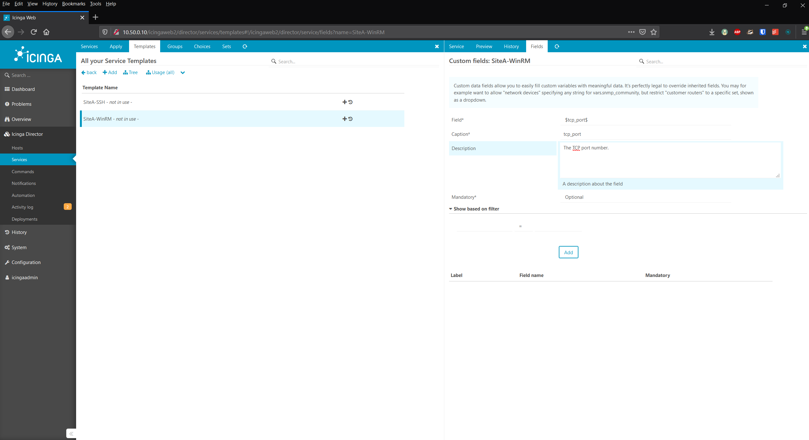

Once you do that you will see the field under `Service -> Custom Properties`


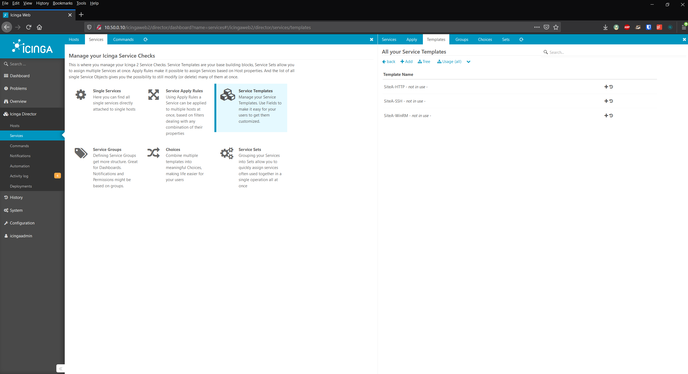

Now that we have our basic three service checks let's verify everything is correct by deploying the configuration.


## Service Sets

In our lab scenario, we know that all of our Linux client endpoints will have SSH and HTTP running while the Windows client endpoints will only have WinRM. We can create a Linux and Windows Service Set for these two respectively which will save us time later on down the road. It will also become even more applicable in the real world where you have hundreds of services across thousands of client endpoints. We can add a service set by going to `Icinga Director -> Services -> Service Sets` and clicking add.

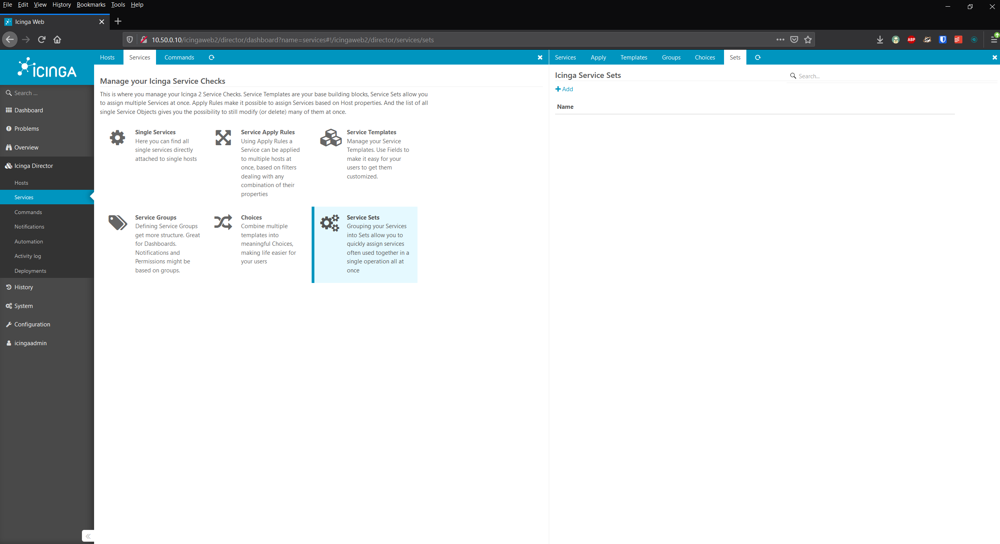

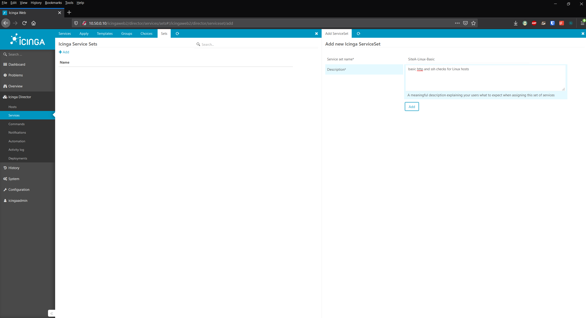

After we hit Add, new tabs will appear at the top. Clicking on `Services` will give us the option to add a service.

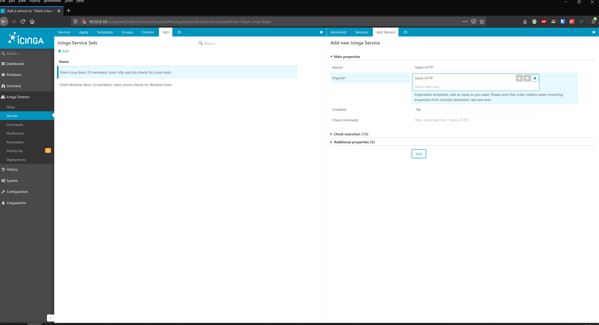

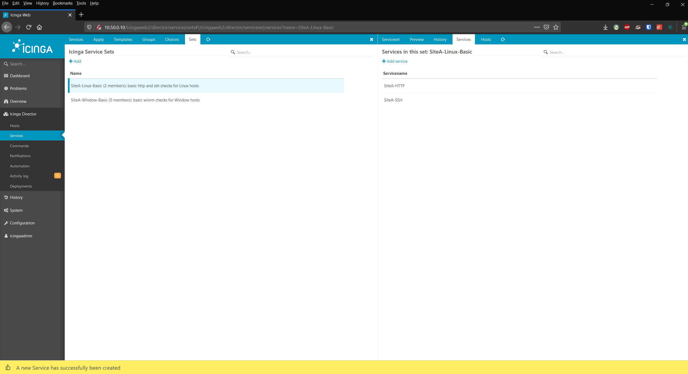

Now we deploy our changes and make sure everything looks good.

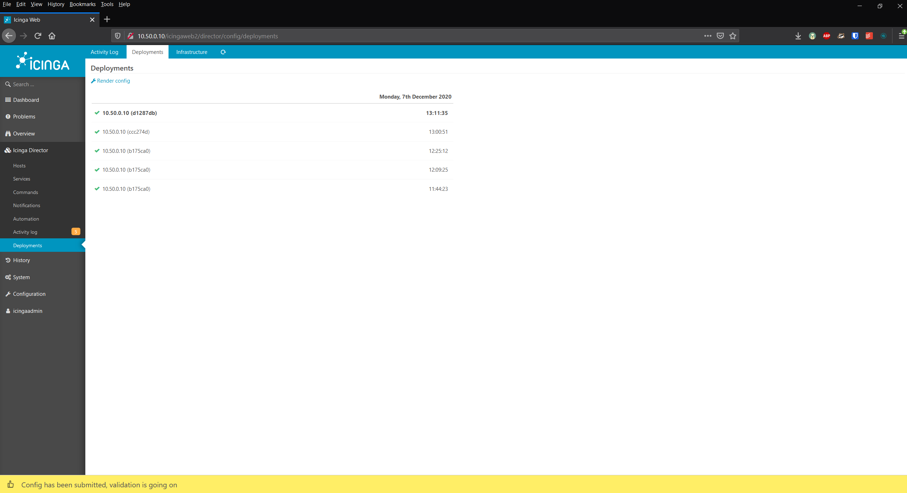

## Host Templates

Next up are host templates. This allows us to define how we want a host to be monitored which helps with scalability. To add one in go to `Icinga Director -> Hosts -> Host Templates -> Add`

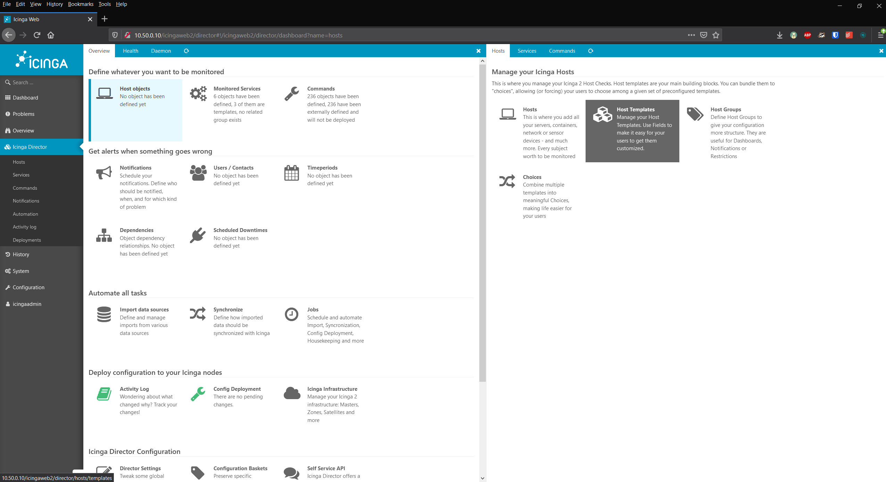

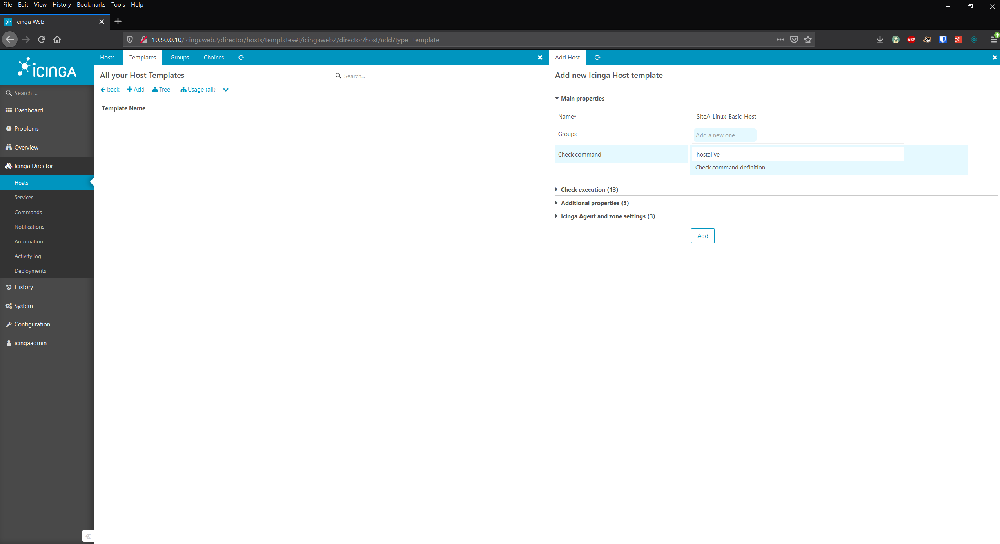

For the `Check command` we are selecting hostalive. This is why we did not specify a ping check in our service templates above. The host template takes care of this. Once we hit add we will see new tabs at the top. Select the services tab and hit add service set.

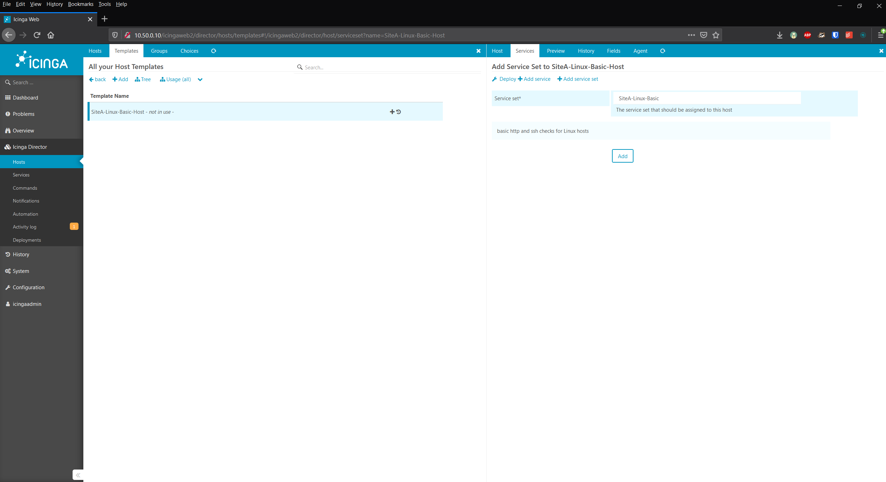

Then we add a template for our Windows client endpoints and then deploy our configuration.

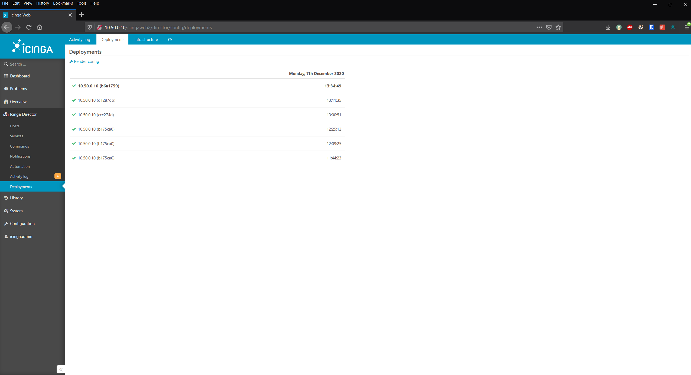

## Hosts

Lastly, we need to add our actual client endpoints. It may seem like we have done a lot of work for just a single host but remember that what we have done is set ourselves to add more hosts a lot easier in the future. Going back into `Icinga Director -> Hosts` we click on Add to get our first client endpoint started.

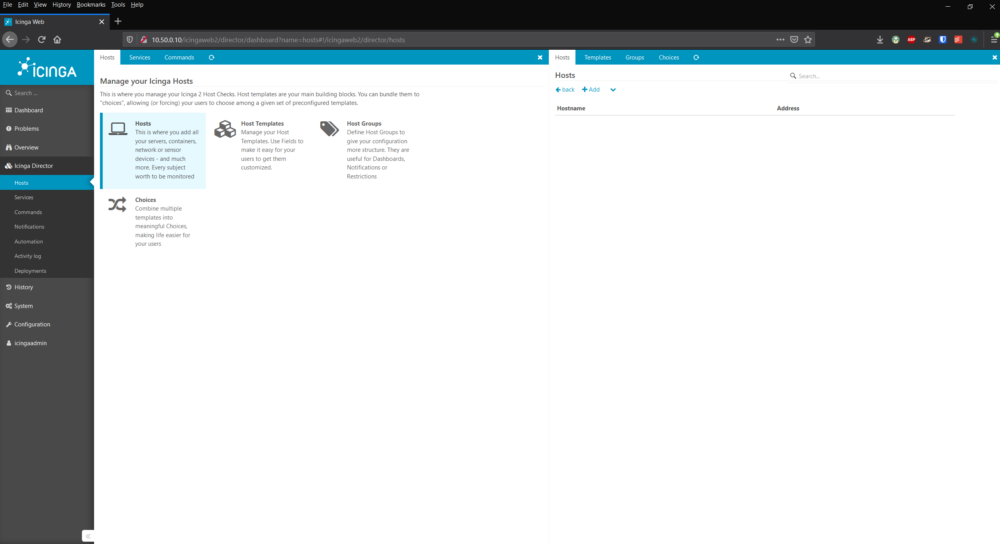

Since our lab environment does not currently have a Windows host, we will choose `SiteA-Linux-Basic-Host` for our template. Now we can fill out the remaining fields accordingly and then hit add.

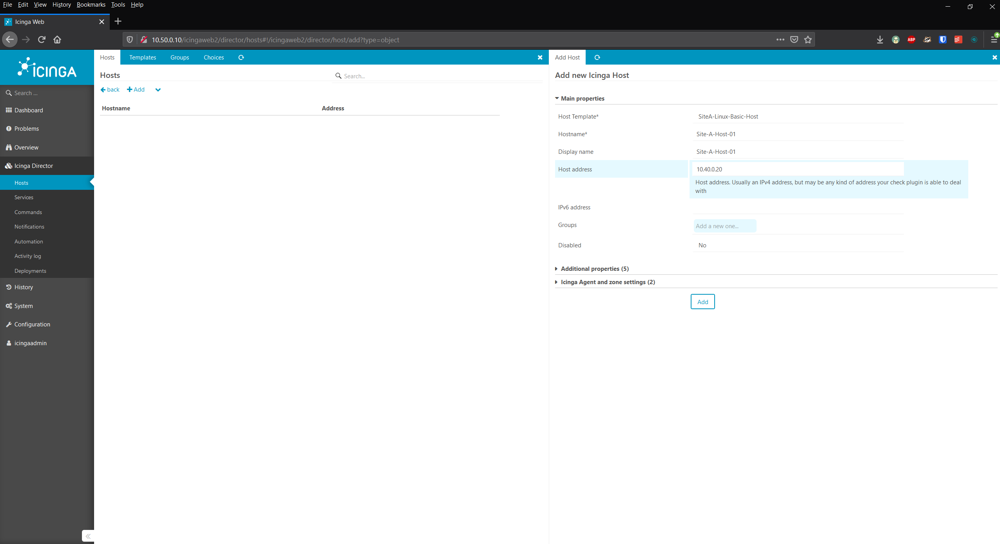

Let's deploy our changes now so that we can check if our work up to this point has been correct.


The configuration deploys without error. Now we should be able to go to our Dashboard and see our host.

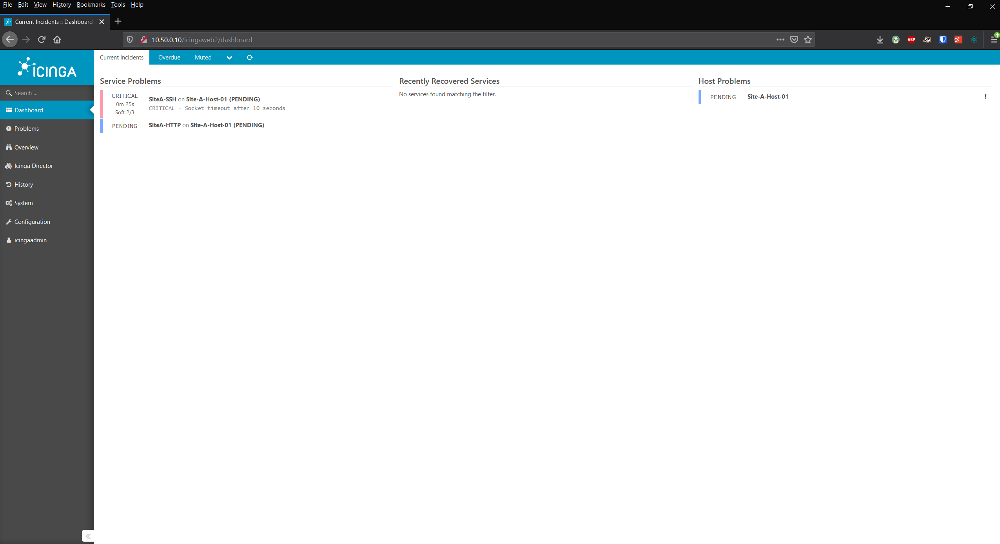

This is not correct at all. Let's dive into troubleshooting and learn how we can figure out what the problem is.

## Troubleshooting

The first thing that we need to know is the Director works out of `/var/lib/icinga2/api/`. This is where a lot of our troubleshooting will take place.

```
root@IcingaMaster:/var/lib/icinga2/api# tree
.
├── log
│   ├── 1607355066
│   ├── 1607355071
│   ├── 1607357376
│   ├── 1607360637
│   ├── 1607361877
│   ├── 1607361916
│   ├── 1607364058
│   ├── 1607364702
│   ├── 1607366096
│   ├── 1607366763
│   ├── 1607367699
│   ├── 1607368132
│   ├── 1607368520
│   ├── 1607368910
│   ├── 1607368971
│   ├── 1607369562
│   ├── 1607369671
│   └── current
├── packages
│   ├── _api
│   │   ├── active.conf
│   │   ├── active-stage
│   │   ├── b4eb9a23-c970-4222-8fdb-5874d260a693
│   │   │   ├── conf.d
│   │   │   │   └── downtimes
│   │   │   ├── include.conf
│   │   │   └── zones.d
│   │   └── include.conf
│   └── director
│       ├── 0943f5b5-bfb8-4178-9b26-0fa6e01fa996
│       │   ├── conf.d
│       │   ├── include.conf
│       │   ├── startup.log
│       │   ├── status
│       │   └── zones.d
│       │       ├── director-global
│       │       │   ├── 001-director-basics.conf
│       │       │   ├── host_templates.conf
│       │       │   └── servicesets.conf
│       │       ├── master
│       │       │   └── hosts.conf
│       │       └── Site-A
│       │           ├── services.conf
│       │           └── service_templates.conf
│       ├── 5e0a481b-1d72-4597-8b8d-193c640bbc9b
│       │   ├── conf.d
│       │   ├── include.conf
│       │   ├── startup.log
│       │   ├── status
│       │   └── zones.d
│       │       ├── director-global
│       │       │   ├── 001-director-basics.conf
│       │       │   ├── host_templates.conf
│       │       │   └── servicesets.conf
│       │       └── Site-A
│       │           ├── hosts.conf
│       │           ├── services.conf
│       │           └── service_templates.conf
│       ├── active.conf
│       ├── active-stage
│       └── include.conf
├── repository
└── zones
    ├── director-global
    │   └── director
    │       ├── 001-director-basics.conf
    │       ├── host_templates.conf
    │       └── servicesets.conf
    ├── master
    │   └── _etc
    │       └── hosts.conf
    └── Site-A
        └── director
            ├── hosts.conf
            ├── services.conf
            └── service_templates.conf

27 directories, 50 files
```

The first thing we will check is the `check source` for Site-A-Host-01. If we go into the dashboard and click on the host we can find out this information.

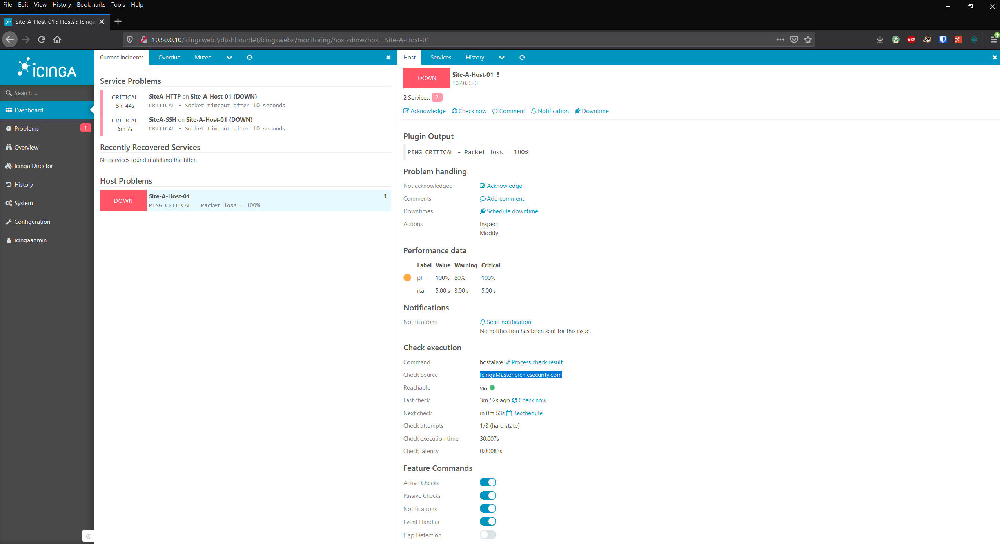

From this we can see that IcingaMaster is checking the host and not Site-A-Satellite. If we go into `/var/lib/icinga2/api/zones/master/director` we can confirm this.

```
root@IcingaMaster:/var/lib/icinga2/api/zones/master/director# cat hosts.conf
object Host "Site-A-Host-01" {
    import "SiteA-Linux-Basic-Host"

    display_name = "Site-A-Host-01"
    address = "10.40.0.20"
}
```

Director believes that Site-A-Host-01 is in the `master` zone when in reality it should be in the `Site-A` zone. We can see the configuration for the `Site-A` zone by going to `Icinga Director -> Icinga Infrastructure -> Zones`, clicking on `Site-A`, and then clicking on the preview tab.


Note that the reason why it is calling it an external object is because we made it ourselves manually and Director then imported it.

If we go back to our host templates and expand `Icinga Agent and zone settings` we can see that `Command endpoint` is blank. Let's change that to `Site-A-Satellite` and deploy the configuration.


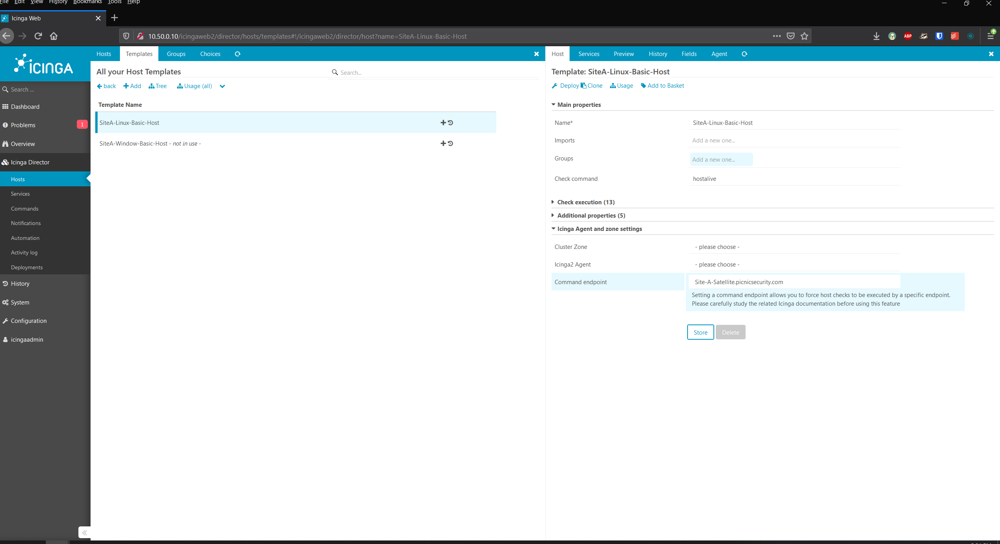

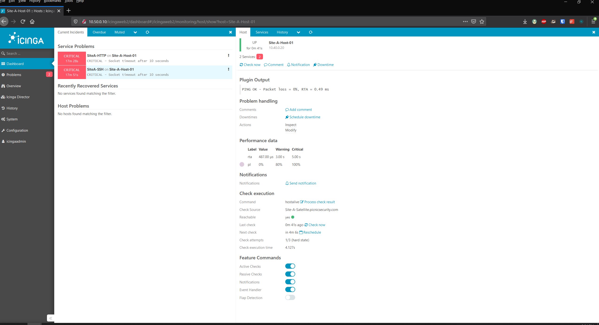

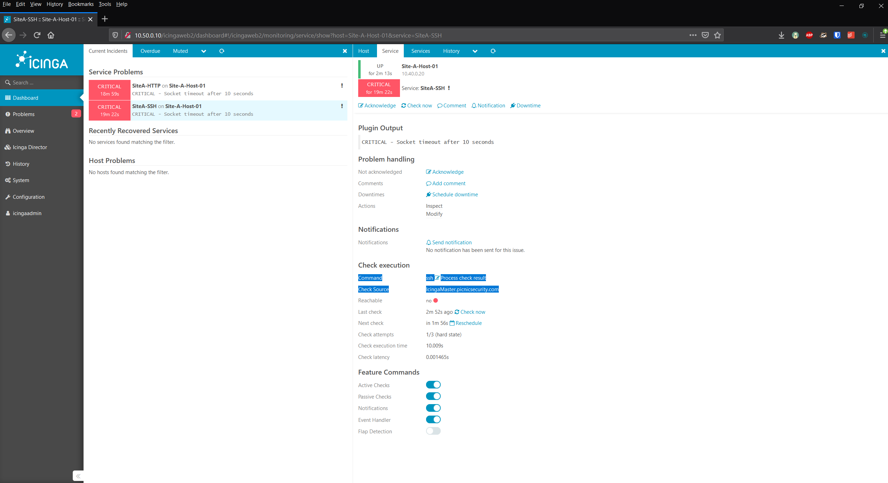

Now the host is up and being checked by our Satellite but the services are still down. This is because we only specified that the `hostalive` command, ie the ping check, should be performed by the Satellite. We now need to make the same changes to the service templates that we just made to our host template.

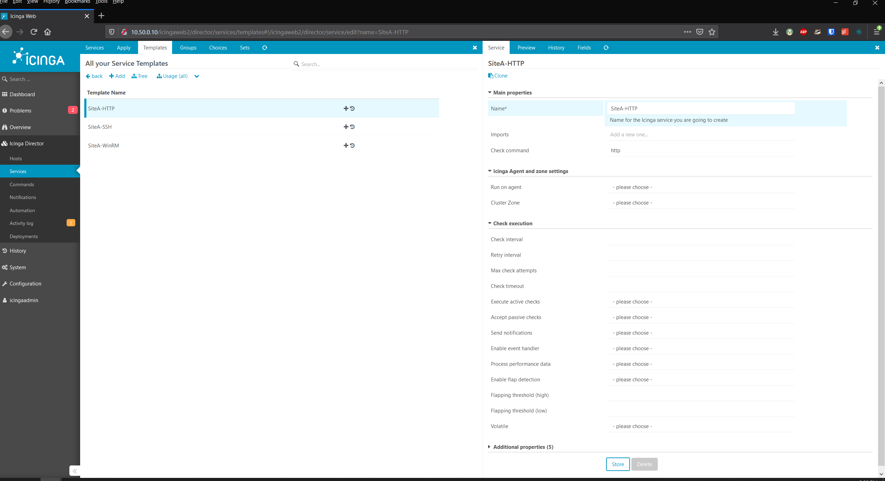

However upon going into the service template we see that there is no `command endpoint` option for us. Let's set the `cluster zone` to be SiteA and see if that helps. After making that change and committing it, we can now see the SSH service as up. HTTP is down simply because we do not have it installed.


For science let's undo the change to the cluster zone and see what happens.

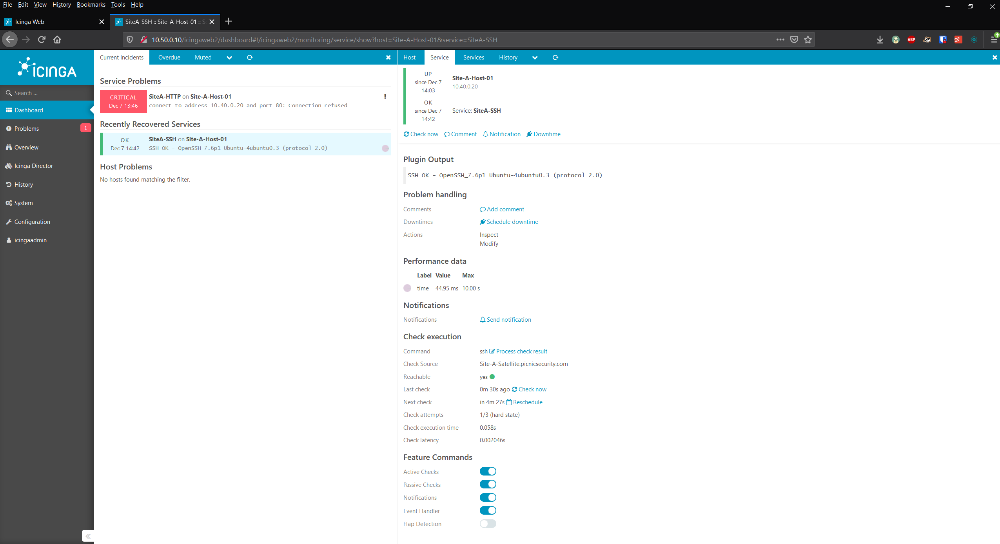

The service is still up despite it not being up prior. It looks like Director just needed to move some files around in order for this to be set correctly? If we go into `Director -> Deployments`, click on our most recent deployment, click on the `Config` tab, then click `Diff with other config`, we can see what changes were made.

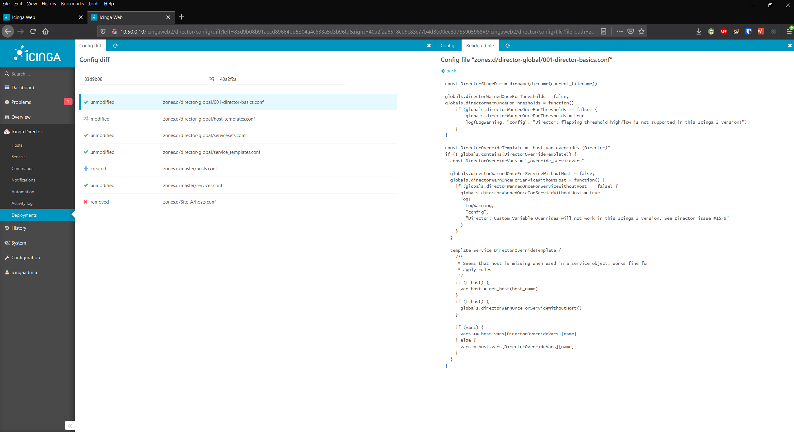

Note that the two Director deployments we are comparing are the one that was made when we fixed the host template to have the correct endpoint, and the most recent commit. Given that it is working I am going to leave it alone for now. I will circle back to this if it becomes an issue again.

## Adding the Remaining Hosts

Now that we have our first host in, the remaining hosts should be easy and straight forward. Lets add them in.

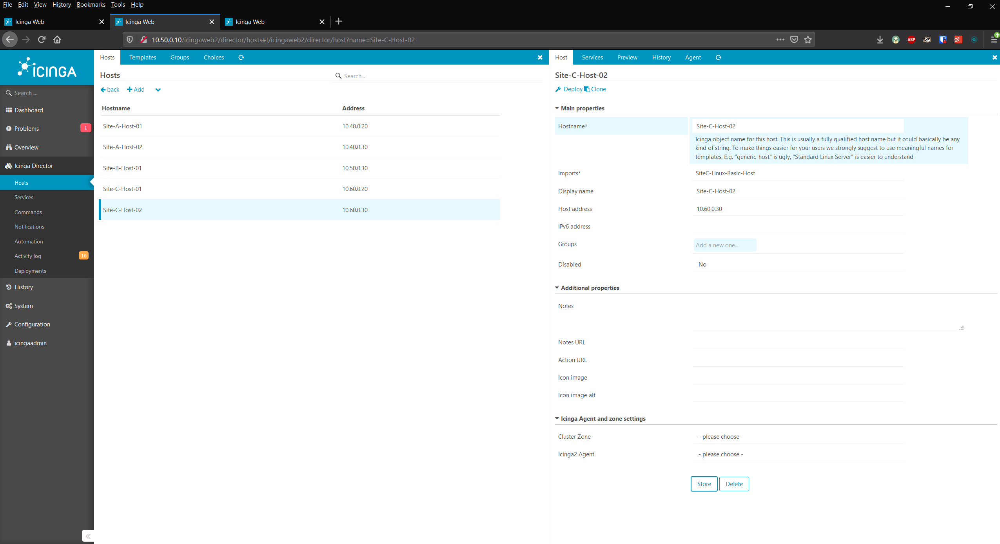

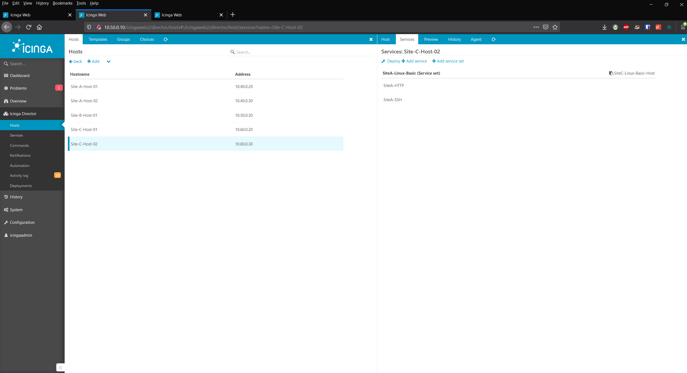

Note that for the service set I did not make a new service set for each site. Since I did not set any zone specific settings for the service sets, I am testing to see if I need a service template for each site in the same way that I need a host template for each site.

Now we deploy our changes and see what happens.

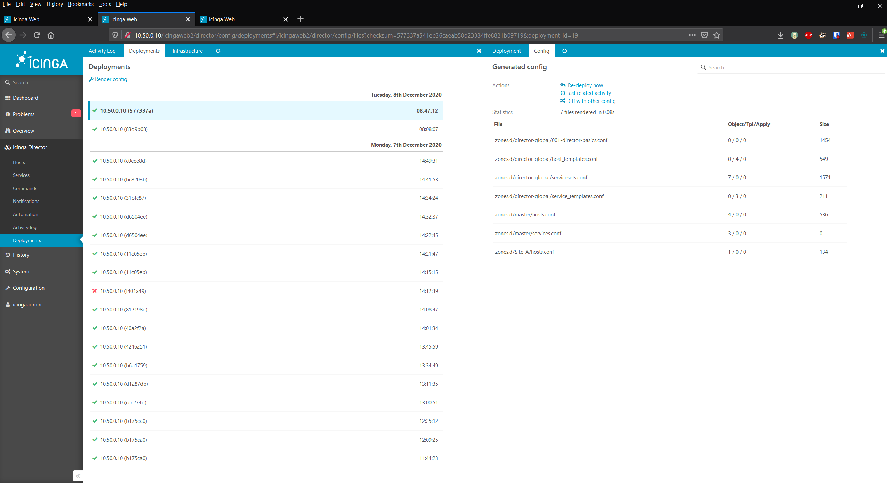

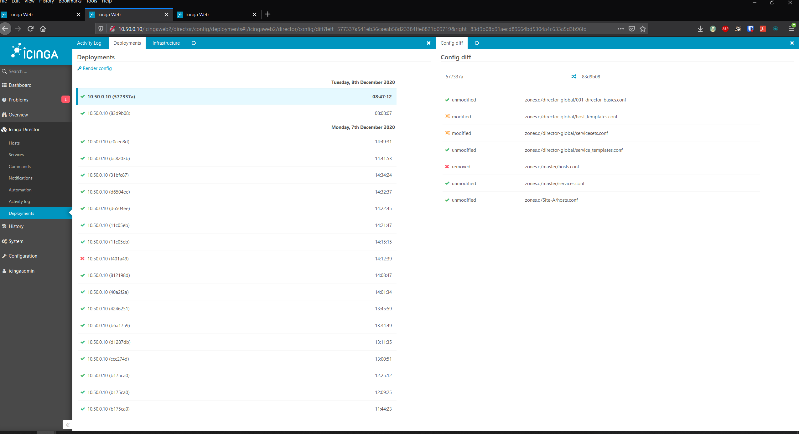

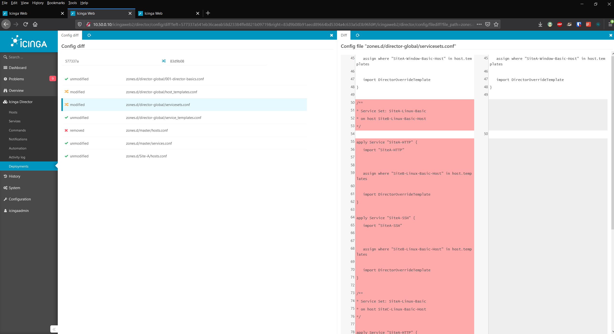

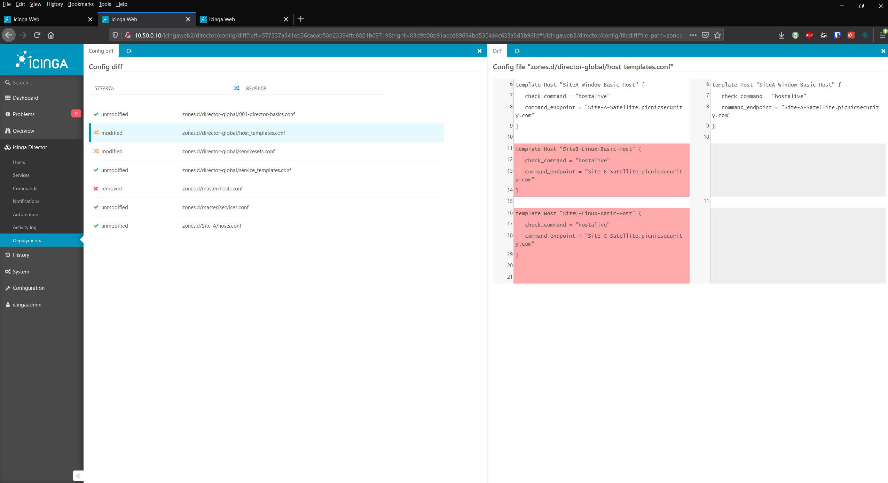

Alright i'll bite, where the hell did these configuration files go? Notice how the only template that we have not used, the windows one, is the only one that remains? Yet, all the ones that we have used keep going away. Why? If we refer back to the troubleshooting section, there can only be two locations where this information is at, `/var/lib/icinga2/api/` and `/etc/icinga2/`. We can use grep to find out if and where the string `Site-C-Satellite.picnicsecurity.com` is located in these directories.

```
root@IcingaMaster:/var/lib/icinga2/api# grep -rin 'Site-C-Satellite.picnicsecurity.com' .
./zones/director-global/director/host_templates.conf:18:    command_endpoint = "Site-C-Satellite.picnicsecurity.com"
./zones/master/_etc/hosts.conf:14:object Host "Site-C-Satellite.picnicsecurity.com" {
./packages/director/fb035f76-9399-4e75-8b6f-98266592802b/zones.d/director-global/host_templates.conf:18:    command_endpoint = "Site-C-Satellite.picnicsecurity.com"
root@IcingaMaster:/var/lib/icinga2/api# cd /etc/icinga2/

root@IcingaMaster:/etc/icinga2# grep -rin 'Site-C-Satellite.picnicsecurity.com' .
./zones.conf:41:object Endpoint "Site-C-Satellite.picnicsecurity.com" {
./zones.conf:46:        endpoints = [ "Site-C-Satellite.picnicsecurity.com" ]
./zones.d/master/hosts.conf:14:object Host "Site-C-Satellite.picnicsecurity.com" {

  root@IcingaMaster:/var/lib/icinga2/api# cat -n zones/director-global/director/host_templates.conf
       1  template Host "SiteA-Linux-Basic-Host" {
       2      check_command = "hostalive"
       3      command_endpoint = "Site-A-Satellite.picnicsecurity.com"
       4  }
       5
       6  template Host "SiteA-Window-Basic-Host" {
       7      check_command = "hostalive"
       8      command_endpoint = "Site-A-Satellite.picnicsecurity.com"
       9  }
      10
      11  template Host "SiteB-Linux-Basic-Host" {
      12      check_command = "hostalive"
      13      command_endpoint = "Site-B-Satellite.picnicsecurity.com"
      14  }
      15
      16  template Host "SiteC-Linux-Basic-Host" {
      17      check_command = "hostalive"
      18      command_endpoint = "Site-C-Satellite.picnicsecurity.com"
      19  }
      20
```

It is weird that it is showing the file as being this and yet in the above screenshot from Director it is showing the file differently. Unfortunately I do not have time to dive deeper into this so I will have to do the despicable thing and _leave this as an exercise for the reader_.

Going back to our dashboard we will see the following.

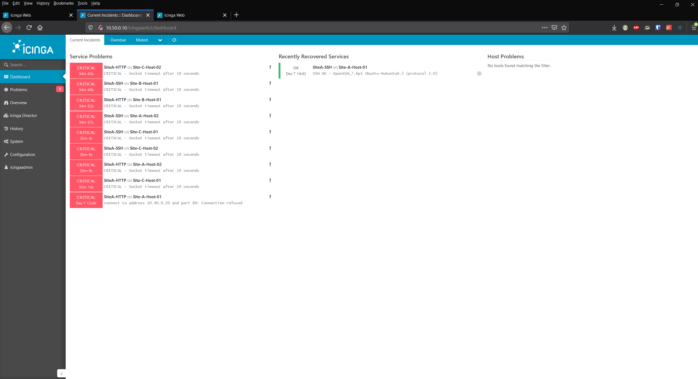

Let's begin another round of troubleshooting

## Troubleshooting

We will repeat our methodology from above by first confirming that the `hostalive` is being performed by the right satellite and then that the service check is also being done by the right satellite

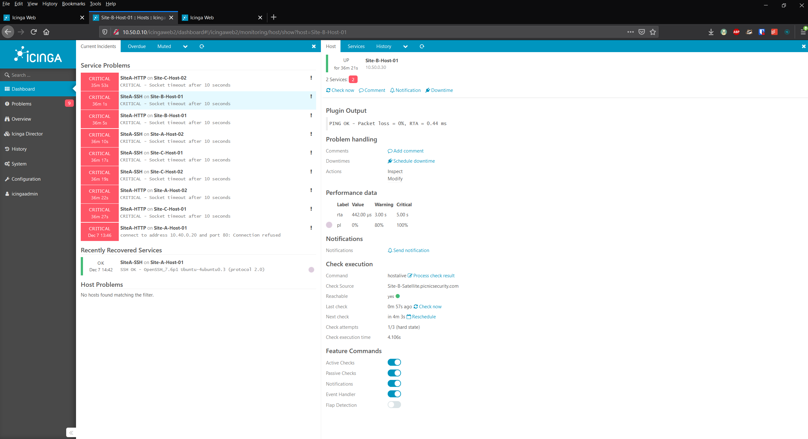

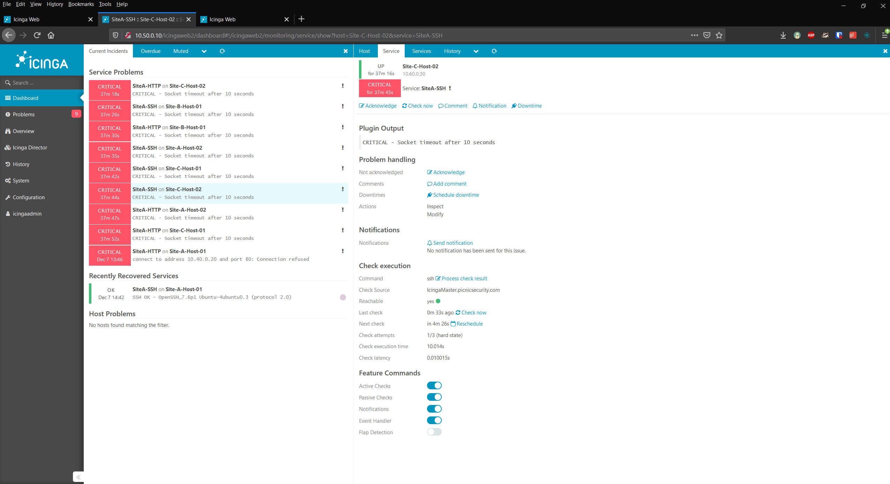

Once again the services are being checked by IcingaMaster and not by the Satellites. We cannot change the `cluster zone` as it may break our working Site-A-Host-01. This means that our next step would instead be to create an SSH check for the SiteB zone. We will also make note that commit `577337a` was when we added all of the remaining hosts and this issue started. It will serve as our baseline comparison.

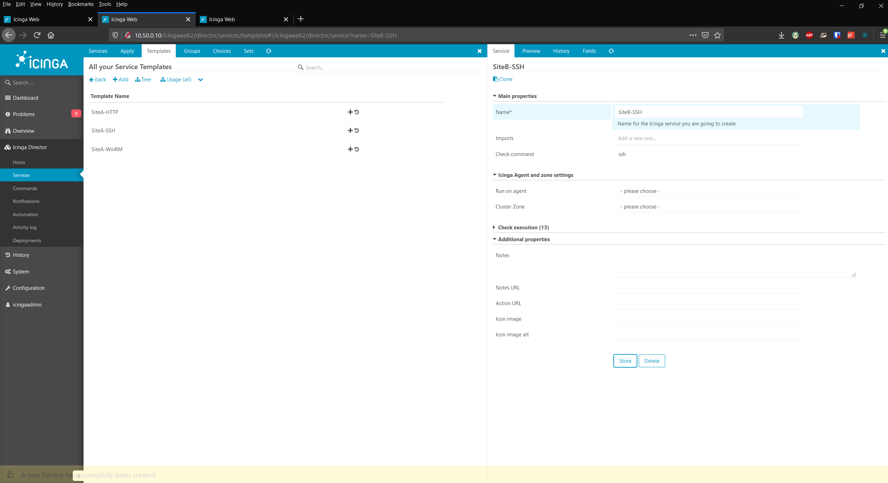

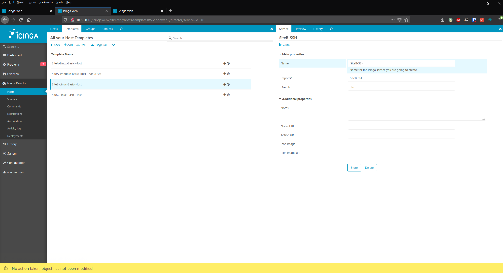

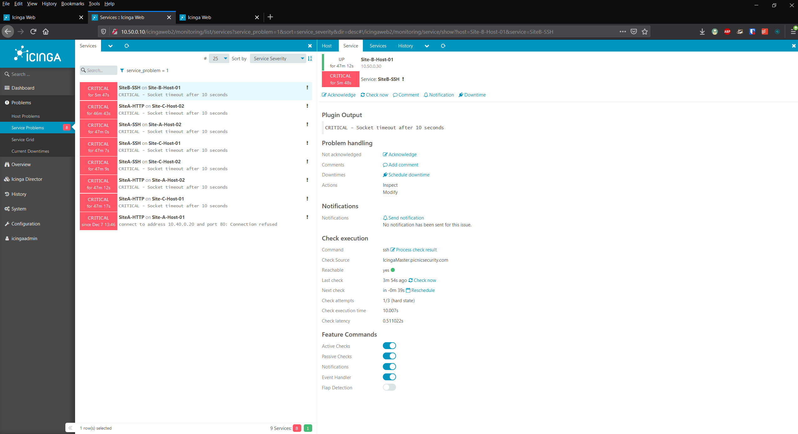

This did not fix the issue. I am going to reboot the server to see if that helps flush any issue. This did not help. We can verify that we have a proper API connection using the following curl command.

```
root@IcingaMaster:~# read PASS

root@IcingaMaster:~# echo $PASS
DirectorAPIPassword123!
root@IcingaMaster:~# curl -k -s -u director:$PASS https://Site-A-Satellite.picnicsecurity.com:5665/v1
<html><head><title>Icinga 2</title></head><h1>Hello from Icinga 2 (Version: r2.12.2-1)!</h1><p>You are authenticated as <b>director</b>. Your user has the following permissions:</p> <ul><li>*</li></ul><p>More information about API requests is available in the <a href="https://icinga.com/docs/icinga2/latest/" target="_blank">documentation</a>.</p></html>

root@IcingaMaster:~# curl -k -s -u director:$PASS https://Site-B-Satellite.picnicsecurity.com:5665/v1
<html><head><title>Icinga 2</title></head><h1>Hello from Icinga 2 (Version: r2.12.2-1)!</h1><p>You are authenticated as <b>director</b>. Your user has the following permissions:</p> <ul><li>*</li></ul><p>More information about API requests is available in the <a href="https://icinga.com/docs/icinga2/latest/" target="_blank">documentation</a>.</p></html>

root@IcingaMaster:~# curl -k -s -u director:$PASS https://Site-C-Satellite.picnicsecurity.com:5665/v1
<html><head><title>Icinga 2</title></head><h1>Hello from Icinga 2 (Version: r2.12.2-1)!</h1><p>You are authenticated as <b>director</b>. Your user has the following permissions:</p> <ul><li>*</li></ul><p>More information about API requests is available in the <a href="https://icinga.com/docs/icinga2/latest/" target="_blank">documentation</a>.</p></html>
```

Director can communicate via the API to all of our satellites so it should be able to push configuration changes to each. I am going to focus in on Site B for now. Let's dive into its the directory structure. More importantly let's compare it to Site A.

```
root@Site-B-Satellite:/var/lib/icinga2/api# tree
.
├── log
│   ├── 1607359467
│   ├── 1607360968
│   ├── 1607364055
│   ├── 1607364699
│   ├── 1607366092
│   ├── 1607367697
│   ├── 1607368130
│   ├── 1607368519
│   ├── 1607368968
│   ├── 1607369668
│   ├── 1607370574
│   ├── 1607432891
│   ├── 1607435235
│   ├── 1607437674
│   ├── 1607437725
│   ├── 1607437929
│   └── current
├── packages
│   └── _api
│       ├── active.conf
│       ├── active-stage
│       ├── bfae29c5-4f18-4f0a-90d4-99ff6de22ce5
│       │   ├── conf.d
│       │   │   └── downtimes
│       │   ├── include.conf
│       │   └── zones.d
│       └── include.conf
├── repository
├── zones
│   ├── director-global
│   │   └── director
│   │       ├── 001-director-basics.conf
│   │       ├── host_templates.conf
│   │       ├── servicesets.conf
│   │       └── service_templates.conf
│   └── Site-B
│       └── director
│           ├── service_apply.conf
│           └── service_templates.conf
└── zones-stage
    ├── director-global
    │   └── director
    │       ├── 001-director-basics.conf
    │       ├── host_templates.conf
    │       ├── servicesets.conf
    │       └── service_templates.conf
    └── Site-B
        └── director
            ├── service_apply.conf
            └── service_templates.conf

18 directories, 33 files
```

```
root@Site-A-Satellite:/var/lib/icinga2/api# tree
.
├── log
│   └── current
├── packages
│   └── _api
│       ├── 9935623f-701a-4a38-a515-1f2044b95778
│       │   ├── conf.d
│       │   │   └── downtimes
│       │   ├── include.conf
│       │   └── zones.d
│       ├── active.conf
│       ├── active-stage
│       └── include.conf
├── repository
├── zones
│   ├── director-global
│   │   └── director
│   │       ├── 001-director-basics.conf
│   │       ├── host_templates.conf
│   │       ├── servicesets.conf
│   │       └── service_templates.conf
│   └── Site-A
│       └── director
│           └── hosts.conf
└── zones-stage
    ├── director-global
    │   └── director
    │       ├── 001-director-basics.conf
    │       ├── host_templates.conf
    │       ├── servicesets.conf
    │       └── service_templates.conf
    └── Site-A
        └── director
            └── hosts.conf

18 directories, 15 files
```

After examining these files I decided it would be best to go back and make service templates, service sets, and host templates for each site.

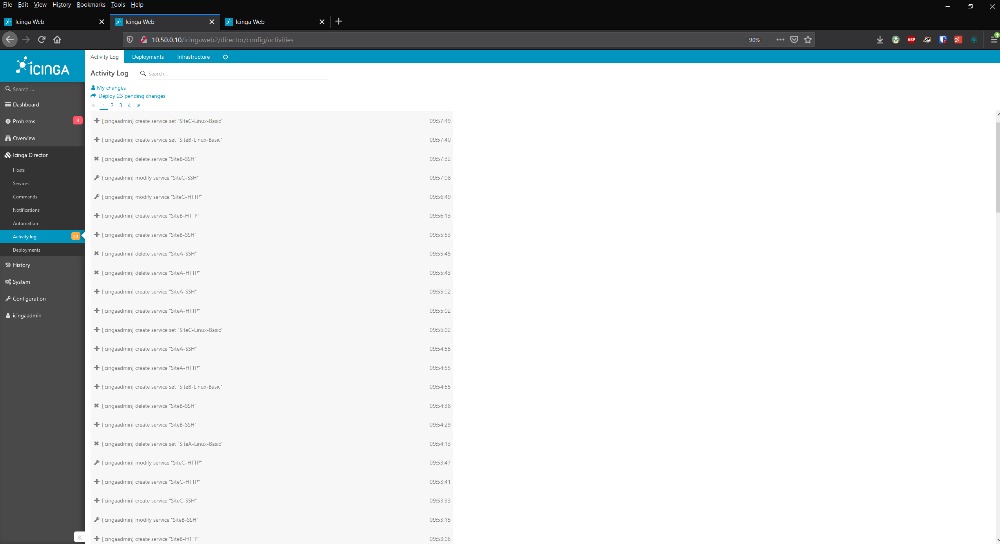

After giving it a couple of minutes to propagate the changes across the satellites, this was my dashboard.

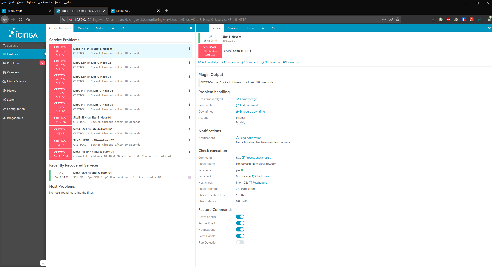

We are still getting errors.

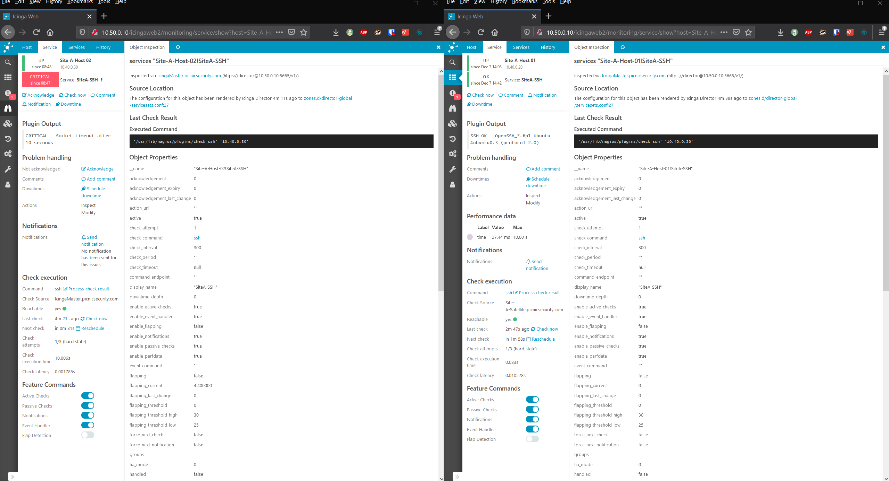

What's weird here is the fact that Site-A-Host-01 and Site-A-Host-02 are configured exactly the same and yet are having different results.

changed the cluster zone on all services back to please choose
https://icinga.com/docs/icinga-2/latest/doc/15-troubleshooting/
ran icinga2 daemon -C on site a and master
confirmed the version was correct and the same
checked which features were enabled on both
made sure log duration was 1 week and then reran kickstart
added director back as the api user on the satellites
reran the icinga2 daemon -C command on A and master
now that we have generated what should be configuration changes onto the satellites I am going to check log on master and site a
I did not see anything that stood out as bad
I triple checked to confirm my firewall rules


## Resources Used


## Special Mentions
